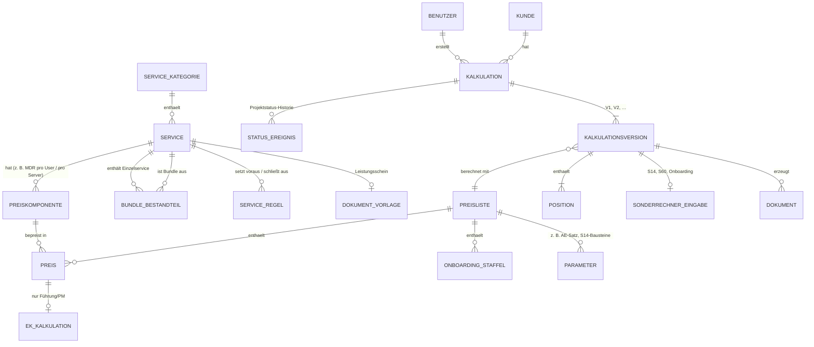
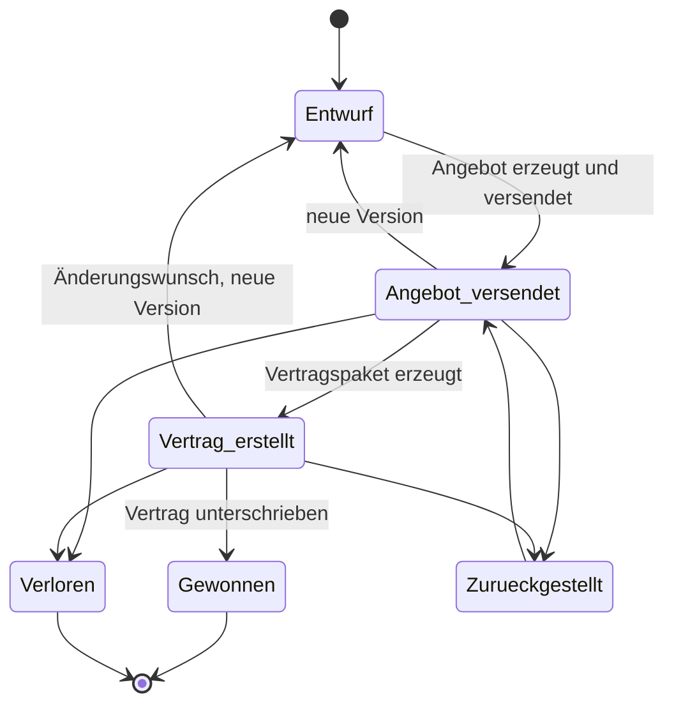

# 03 – Fachmodell

> Status: **Entwurf v2** (25.09.2026), abgeleitet aus der SharePoint-Analyse
> ([06_ist-analyse.md](06_ist-analyse.md)).

## Zentrale Designprinzipien

1. **Datengetrieben statt hartcodiert:** Services, Preise, Bundles, Regeln und
   Vorlagen stehen in der Datenbank. Sie werden über die Oberfläche gepflegt,
   nicht im Programmcode. Ausnahme sind Spezialrechner mit eigener Logik
   (Onboarding, Supportkontingent, Server Backup): Ihre **Parameter** sind pflegbar,
   ihr **Rechenweg** ist Code und durch Tests abgesichert.
2. **Unveränderliche Historie:** Eine gespeicherte Kalkulationsversion „friert“
   Preise, Bezeichnungen und Vorlagenversionen ein, als Momentaufnahme.
   Spätere Preisänderungen verändern alte Angebote nicht.
3. **Eine Rechenlogik für alles:** Kalkulator, Angebot, Vertrag und Statistik
   nutzen denselben Rechenkern.
4. **EK strikt getrennt:** EK und Marge liegen in eigenen Tabellen. Sie werden
   nur für berechtigte Rollen geladen, nicht bloß in der Oberfläche ausgeblendet.

## Objekte und Beziehungen

## Objektbeschreibungen

| Objekt | Zweck | Wichtige Felder (Entwurf) |
|--------|-------|---------------------------|
| **Servicekategorie** | Gruppierung im Katalog | Name (Nösse Connect, User/Server/Security/Network as a Service, Add-ons, Optionen), Sortierung |
| **Service** | Verkaufbare Leistung (Einzelservice, Bundle, Connect-Stufe, Option) | Code (S02, B01 …), Service-ID (NOS-…), Bezeichnung, Typ (Connect/Bundle/Einzel/Add-on/Option), Kurzbeschreibung, Vertriebsstatus (verkaufsfähig/auf Anfrage/geparkt/zukünftig) |
| **Preiskomponente** | Abrechenbare Einheit eines Service | Einheit (Kunde, User, Server, Firewall, Tenant, AD-Umgebung, Switch, AP, Netzwerkgerät, Device, NAS, Client), monatlich/einmalig |
| **Bundle-Bestandteil** | Welche Einzelservices ein Bundle enthält | Bundle, Einzelservice (z. B. B02 → B01-Inhalt + S05, S06, S07) |
| **Serviceregel** | Fachliche Prüfungen | Typ (erfordert, schließt aus, genau eine aus Gruppe, nicht verkaufen), Meldungstext |
| **Preisliste** | Versionierter Preisstand | Version, gültig ab, Status (Entwurf/freigegeben). Start: „Preisstand 15.07.2026“ |
| **Preis** | VK je Preiskomponente und Preisliste | VK netto |
| **EK-Kalkulation** | Interne Kosten je Preiskomponente | EK/Lizenz, Aufwand Min./Monat, Overhead, Gesamtkosten, DB, Marge |
| **Onboarding-Staffel** | Einmalpauschale | Größe (XS–L), AP von/bis, Connect-Stufe, Betrag |
| **Parameter** | Zentrale Sätze | AE-Satz Ebene 1/2/3, Commitment-Rabatt S60, S14-Bausteine S1/S2/F1–F3, Paketgröße 500 GB, EK-Kostensatz |
| **Dokument-Vorlage** | Word-Vorlage | Typ (Angebot, Grundvertrag, AVB, SLA, AVV, Leistungsschein), Code, Version, Datei, gültig ab |
| **Kunde** | Minimaler Kundendatensatz | Firma, Anschrift, Ansprechpartner; später HubSpot-ID |
| **Kalkulation** | Vorgang zu einem Kunden | Titel, Kunde, Ersteller, **Projektstatus**, Verlustgrund, Neukunde/Bestandskunde |
| **Status-Ereignis** | Historie des Projektstatus | alter/neuer Status, wer, wann, Kommentar |
| **Kalkulationsversion** | Konkreter Angebotsstand | Nummer, Connect-Stufe, Anzahl User (für Onboarding), Vertragsbeginn, Summen (eingefroren), Preislistenversion, Alt-Monatspreis (Vorher/Nachher) |
| **Position** | Service × Menge | Service, Preiskomponente, Menge, Einzelpreis (eingefroren), Betrag, Hinweis „im Bundle enthalten“ |
| **Sonderrechner-Eingabe** | Eingaben der Spezialrechner | S60: Anfragen/Monat, Ø AE; S14: Variante, Server, Datenmenge, Lizenzherkunft, Checkliste; S25: Clients, Server; S61: Buchungsübersicht, TERRA-Wert, Backup-Entscheidung; S41: Roadmap-Erstellung ja/nein |
| **Sonderposition** | Freie Position | Bezeichnung, Einheit, Menge, Preis, Begründung, Kennzeichen |
| **Dokument** | Erzeugte Datei | Typ (Angebot/Vertragspaket), Nummer, Dateiname, Vorlagenversionen, erzeugt am/von |

## Projektstatus einer Kalkulation (bestätigt 25.09.2026)

Der Vertrieb setzt den Status selbst. Jede Änderung wird mit Zeitstempel
protokolliert, das ist Grundlage für Pipeline- und Trendstatistiken. Bei
„Verloren“ ist ein Verlustgrund Pflicht (Auswahlliste plus Freitext).

## Rechenkern: Ablauf einer Berechnung

1. Positionen: `Betrag = RUNDEN(VK × Menge; 2)`
2. Bundle-Deduplizierung: Einzelservices, die in einem gebuchten Bundle enthalten sind, werden bis zur Bundle-Menge mit 0 € berechnet und gekennzeichnet (Regel R3)
3. Sonderrechner: S60 (Supportkontingent), S14 (Server Backup) → jeweils eine Position
4. Summe monatlich; Onboarding aus Staffel (Connect-Stufe × User; ab 501 User „individuell“)
5. Kennzahlen: MRR = Summe monatlich; ARR = 12 × MRR; Wert der Erstlaufzeit = 12 × MRR + Onboarding
6. Nur für berechtigte Rollen: Kosten, DB und Marge je Position und gesamt
7. Regelprüfung (R1–R6) → Fehler (blockiert Angebot) oder Hinweis

## Auflösung des Vertragspakets (Algorithmus)

1. Rahmendokumente in fester Reihenfolge: AVV, Grundvertrag, AVB, Anlage SLA (mit gewählter Connect-Stufe), S01 (gewählte Stufe).
2. Für jedes gebuchte Bundle (Reihenfolge nach Code): B-Schein, danach rekursiv alle enthaltenen S-Scheine. Verschachtelte Bundles werden aufgelöst, aber nicht selbst beigelegt.
3. Danach alle einzeln gebuchten S-Scheine (nach Code), sofern nicht bereits durch ein Bundle enthalten.
4. Sonderpositionen haben keinen Leistungsschein. Sie erscheinen nur im Angebot und in § 3 des Grundvertrags.
