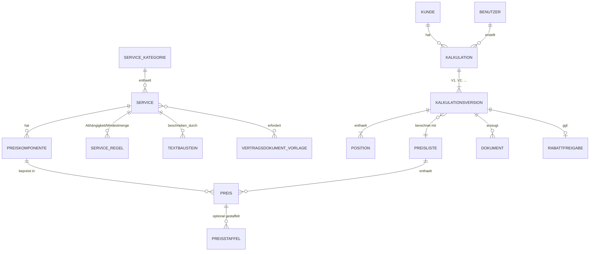
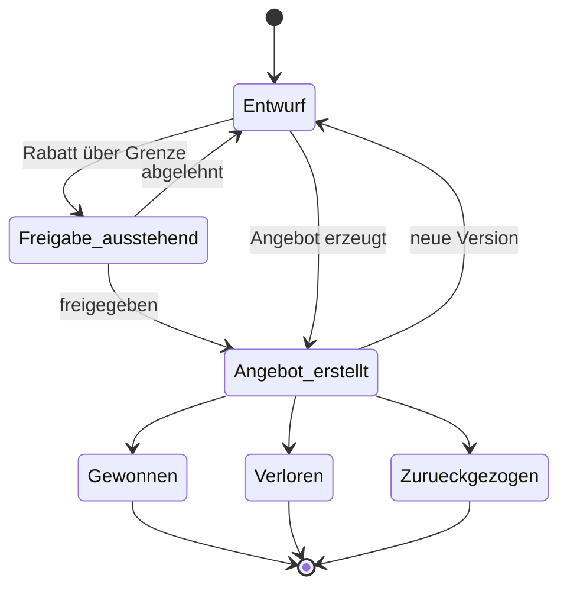

# 03 – Fachmodell (erster Entwurf)

> Status: **Entwurf.** Das Modell wird verfeinert, sobald die Antworten zu
> [Offene Fragen, Abschnitt 1](02_offene-fragen.md#1-services-und-preislogik-) vorliegen.

## Zentrale Designprinzipien

1. **Datengetrieben statt hartcodiert:** Services, Preise, Regeln und Texte
   stehen in der Datenbank. Sie werden über die Oberfläche gepflegt, nicht im
   Programmcode.
2. **Unveränderliche Historie:** Eine gespeicherte Kalkulationsversion
   „friert“ Preise und Texte ein, als Momentaufnahme. Spätere Preisänderungen
   verändern alte Angebote nicht. Das ist wichtig für Nachvollziehbarkeit
   und Statistik.
3. **Eine Rechenlogik für alles:** Kalkulator, Angebot, Vertrag und Statistik
   nutzen dieselbe Berechnung. So gibt es keine abweichenden Zahlen.

## Objekte und Beziehungen

## Objektbeschreibungen

| Objekt | Zweck | Wichtige Felder (Entwurf) |
|--------|-------|---------------------------|
| **Servicekategorie** | Gruppierung im Katalog | Name, Sortierung |
| **Service** | Ein verkaufbarer Managed Service | Name, Kurzbeschreibung, Kategorie, aktiv/inaktiv |
| **Preiskomponente** | Wie ein Service bepreist wird | Einheit (User, Gerät, Server, pauschal), Art (monatlich/einmalig), Mindestmenge |
| **Preisliste** | Versionierte Sammlung aller Preise | Version, gültig ab, gültig bis, Status (Entwurf/freigegeben) |
| **Preis** | Verkaufspreis und interner Kostensatz je Komponente und Preisliste | VK, EK/Kostensatz, Service-Level |
| **Preisstaffel** | Mengenabhängige Preise | Menge ab, Preis |
| **Serviceregel** | Fachliche Prüfungen | Typ (erfordert, schließt aus, Mindestmenge), Meldungstext |
| **Textbaustein** | Angebotstexte je Service | Leistungsinhalt, Voraussetzungen, Ausschlüsse; versioniert |
| **Vertragsdokument-Vorlage** | Word-Vorlage für Vertragsunterlagen | Dokumenttyp, Version, gilt immer / nur bei bestimmten Services |
| **Kunde** | Minimaler Kundendatensatz | Firma, Anschrift, Ansprechpartner, ggf. HubSpot-ID |
| **Kalkulation** | Der „Vorgang“ zu einem Kunden | Titel, Kunde, Ersteller, Status, Verlustgrund |
| **Kalkulationsversion** | Ein konkreter Angebotsstand | Nummer, Laufzeit, Startdatum, Rabatt, Summen (eingefroren), Preislistenversion |
| **Position** | Ein Service mit Menge in einer Version | Service, Komponente, Menge, Einzelpreis (eingefroren), Rabatt |
| **Dokument** | Erzeugte Datei (Angebot, Vertragspaket) | Typ, Dateiname, Vorlagenversion, erzeugt am/von |
| **Rabattfreigabe** | Freigabe über der Rabattgrenze | Angefragt von, freigegeben von, Zeitpunkt, Kommentar |

## Statusmodell einer Kalkulation

