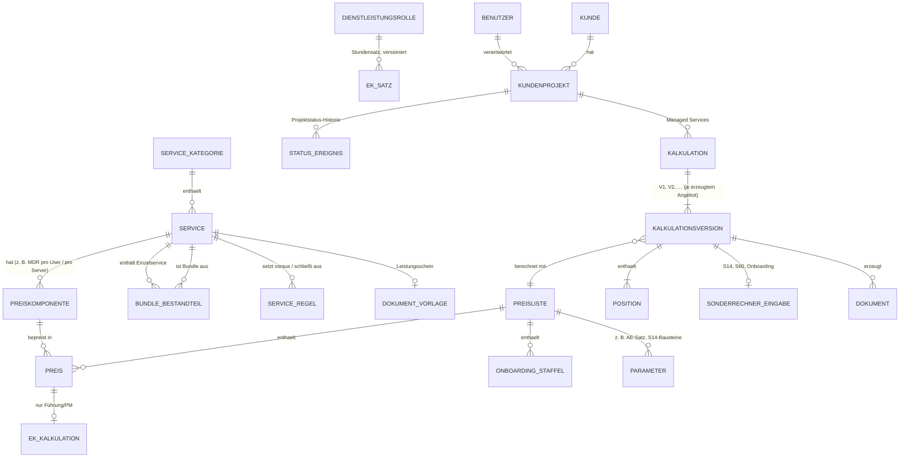
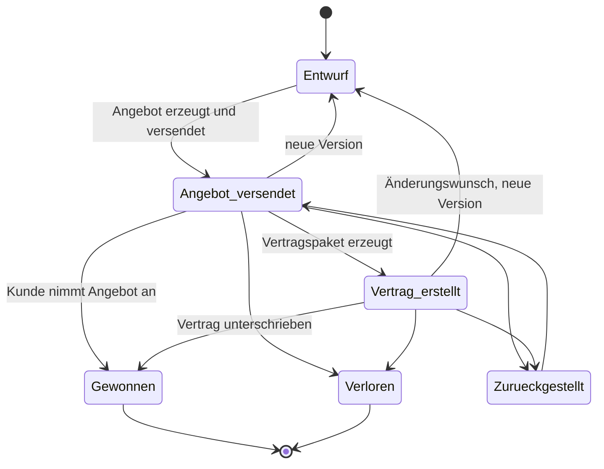
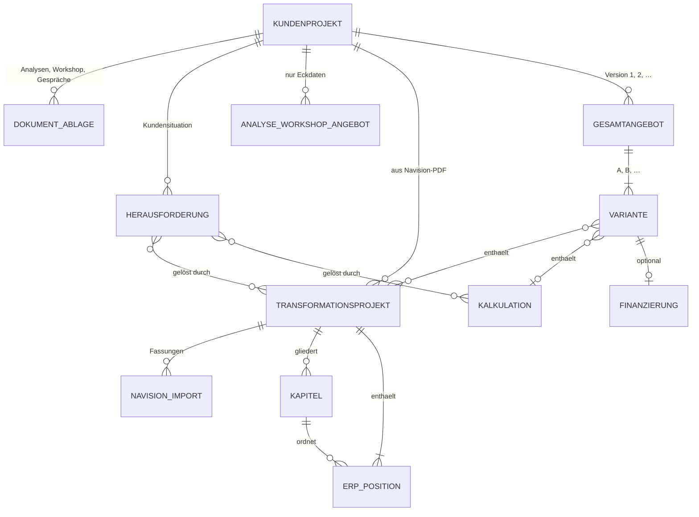

# 03 – Fachmodell

> Status: **Entwurf v3** (30.09.2026), abgeleitet aus der SharePoint-Analyse
> ([06_ist-analyse.md](06_ist-analyse.md)) und dem Gesamtkonzept
> ([10_gesamtkonzept.md](10_gesamtkonzept.md)). Neu in v3: Kundenprojekt als
> oberstes Objekt, Objekte für Stufe 2, Navision-Artikelnummern.

## Zentrale Designprinzipien

1. **Datengetrieben statt hartcodiert:** Services, Preise, Bundles, Regeln und
   Vorlagen stehen in der Datenbank. Sie werden über die Oberfläche gepflegt,
   nicht im Programmcode. Ausnahme sind Spezialrechner mit eigener Logik
   (Onboarding, Supportkontingent, Server Backup): Ihre **Parameter** sind pflegbar,
   ihr **Rechenweg** ist Code und durch Tests abgesichert.
2. **Unveränderliche Historie:** Eine gespeicherte Kalkulationsversion „friert“
   Preise, Bezeichnungen und Vorlagenversionen ein, als Momentaufnahme.
   Spätere Preisänderungen verändern alte Angebote nicht.
3. **Eine Rechenlogik für alles:** Kalkulator, Angebot, Vertrag und Statistik
   nutzen denselben Rechenkern.
4. **EK strikt getrennt:** EK und Marge liegen in eigenen Tabellen. Sie werden
   nur für berechtigte Rollen geladen, nicht bloß in der Oberfläche ausgeblendet.

## Objekte und Beziehungen

```mermaid
erDiagram
    SERVICE_KATEGORIE ||--o{ SERVICE : enthaelt
    SERVICE ||--o{ PREISKOMPONENTE : "hat (z. B. MDR pro User / pro Server)"
    SERVICE ||--o{ BUNDLE_BESTANDTEIL : "ist Bundle aus"
    BUNDLE_BESTANDTEIL }o--|| SERVICE : "enthält Einzelservice"
    SERVICE ||--o{ SERVICE_REGEL : "setzt voraus / schließt aus"
    SERVICE ||--o| DOKUMENT_VORLAGE : "Leistungsschein"
    PREISLISTE ||--o{ PREIS : enthaelt
    PREISKOMPONENTE ||--o{ PREIS : "bepreist in"
    PREISLISTE ||--o{ ONBOARDING_STAFFEL : enthaelt
    PREISLISTE ||--o{ PARAMETER : "z. B. AE-Satz, S14-Bausteine"
    PREIS ||--o| EK_KALKULATION : "nur Führung/PM"
    DIENSTLEISTUNGSROLLE ||--o{ EK_SATZ : "Stundensatz, versioniert"

    KUNDE ||--o{ KUNDENPROJEKT : hat
    BENUTZER ||--o{ KUNDENPROJEKT : verantwortet
    KUNDENPROJEKT ||--o{ STATUS_EREIGNIS : "Projektstatus-Historie"
    KUNDENPROJEKT ||--o{ KALKULATION : "Managed Services"
    KALKULATION ||--|{ KALKULATIONSVERSION : "V1, V2, … (je erzeugtem Angebot)"
    KALKULATIONSVERSION }o--|| PREISLISTE : "berechnet mit"
    KALKULATIONSVERSION ||--|{ POSITION : enthaelt
    KALKULATIONSVERSION ||--o| SONDERRECHNER_EINGABE : "S14, S60, Onboarding"
    KALKULATIONSVERSION ||--o{ DOKUMENT : erzeugt
```

## Objektbeschreibungen

| Objekt | Zweck | Wichtige Felder (Entwurf) |
|--------|-------|---------------------------|
| **Servicekategorie** | Gruppierung im Katalog | Name (Nösse Connect, User/Server/Security/Network as a Service, Add-ons, Optionen), Sortierung |
| **Service** | Verkaufbare Leistung (Einzelservice, Bundle, Connect-Stufe, Option) | Code (S02, B01 …), Service-ID (NOS-…), Bezeichnung, Typ (Connect/Bundle/Einzel/Add-on/Option), Kurzbeschreibung, Vertriebsstatus (verkaufsfähig/auf Anfrage/geparkt/zukünftig) |
| **Preiskomponente** | Abrechenbare Einheit eines Service | Einheit (Kunde, User, Server, Firewall, Tenant, AD-Umgebung, Switch, AP, Netzwerkgerät, Device, NAS, Client), monatlich/einmalig, **Navision-Artikelnummer** |
| **Bundle-Bestandteil** | Welche Einzelservices ein Bundle enthält | Bundle, Einzelservice (z. B. B02 → B01-Inhalt + S05, S06, S07) |
| **Serviceregel** | Fachliche Prüfungen | Typ (erfordert, schließt aus, genau eine aus Gruppe, nicht verkaufen), Meldungstext |
| **Preisliste** | Versionierter Preisstand | Version, gültig ab, Status (Entwurf/freigegeben). Start: „Preisstand 15.07.2026“ |
| **Preis** | VK je Preiskomponente und Preisliste | VK netto |
| **EK-Kalkulation** | Interne Kosten je Preiskomponente | EK/Lizenz, Aufwand Min./Monat, Overhead, Gesamtkosten, DB, Marge |
| **Onboarding-Staffel** | Einmalpauschale | Größe (XS–L), AP von/bis, Connect-Stufe, Betrag |
| **Parameter** | Zentrale Sätze | AE-Satz Ebene 1/2/3, Commitment-Rabatt S60, S14-Bausteine S1/S2/F1–F3, Paketgröße 500 GB, EK-Kostensatz |
| **Dienstleistungsrolle** | Rolle für Projektdienstleistung (Stufe 2) | Bezeichnung, Navision-Artikelnummer, interner Stundensatz (EK, nur berechtigte Rollen), gültig ab |
| **Dokument-Vorlage** | Word-Vorlage | Typ (Angebot, Grundvertrag, AVB, SLA, AVV, Leistungsschein), Code, Version, Datei, gültig ab |
| **Kunde** | Minimaler Kundendatensatz | Firma, Anschrift, Ansprechpartner, **Navision-Kundennummer**; später HubSpot-ID |
| **Kundenprojekt** | Oberstes Objekt: alles, was einem Kunden zu einem Vorhaben angeboten wird | Titel, Kunde, verantwortlicher Vertrieb, **Projektstatus**, Verlustgrund, Neukunde/Bestandskunde, Forecast (Wahrscheinlichkeit %, erwarteter Abschlussmonat) |
| **Kalkulation** | Managed-Services-Kalkulation innerhalb eines Kundenprojekts | Titel, Ersteller, Vertragsbeginn, **ein bearbeitbarer Arbeitsstand** (Eingabe als JSON), Kennzeichen „zählt im Forecast“ (genau eine je Projekt); mehrere je Kundenprojekt möglich (Varianten) |
| **Status-Ereignis** | Historie des Projektstatus (am Kundenprojekt) | alter/neuer Status, wer, wann, Kommentar |
| **Kalkulationsversion** | Konkreter Angebotsstand, entsteht erst beim Erzeugen eines Angebots aus dem Arbeitsstand (Entscheidung 01.10.2026); unveränderlich | Nummer (V1, V2 …), vollständige Eingabe (inkl. Anzahl User, Alt-Monatspreis, Sonderpositionen), Vertragsbeginn, Summen (eingefroren), Preislistenversion, erstellt von/am. Die Connect-Stufe ergibt sich aus den Positionen |
| **Position** | Eingefrorene Ergebniszeile einer Version | Komponenten- und Service-Code, Bezeichnung, Menge, berechnete Menge, Einzelpreis, Betrag, Abrechnungsart, Herkunft (Katalog, Onboarding, Sonderrechner, Sonderposition), Hinweis „im Bundle enthalten“. Kosten je Zeile liegen getrennt im Schema `intern` |
| **Sonderrechner-Eingabe** | Eingaben der Spezialrechner | S60: Anfragen/Monat, Ø AE; S14: Variante, Server, Datenmenge, Lizenzherkunft, Checkliste; S25: Clients, Server; S61: Buchungsübersicht, TERRA-Wert, Backup-Entscheidung; S41: Roadmap-Erstellung ja/nein |
| **Sonderposition** | Freie Position im Arbeitsstand | Bezeichnung, Einheit, Menge, Preis, Begründung, Freigabestatus (offen/freigegeben/abgelehnt), entschieden von/am, Kommentar (bei Ablehnung Pflicht). Jede inhaltliche Änderung setzt die Freigabe auf „offen“ zurück, ebenso das Duplizieren der Kalkulation (Entscheidung 02.10.2026) |
| **Vertriebsfreigabe** | Freigabe einer Kalkulation vor dem Angebot (#26, Entscheidung 04.10.2026) | Rolle (Vertriebsleitung / Solution Consultant), wer, wann, Kommentar; aufgehoben am/von, Grund. Je Rolle höchstens eine aktive Freigabe. Ein Angebot entsteht nur mit beiden aktiven Freigaben; sie werden in die Kalkulationsversion übernommen. Jede inhaltliche Änderung (Positionen, Mengen, Sonderrechner, Sonderpositionen, Vertragsbeginn) hebt beide auf. Vier-Augen-Prinzip: Wer das Kundenprojekt verantwortet, gibt nicht frei, und beide Freigaben kommen von verschiedenen Personen |
| **Dokument** | Erzeugte Datei | Typ (Angebot/Vertragspaket), Nummer, Dateiname, Vorlagenversionen, erzeugt am/von |

## Projektstatus eines Kundenprojekts (bestätigt 25.09.2026, am Kundenprojekt seit 29.09.2026)

```mermaid
stateDiagram-v2
    [*] --> Entwurf
    Entwurf --> Angebot_versendet: Angebot erzeugt und versendet
    Angebot_versendet --> Entwurf: neue Version
    Angebot_versendet --> Gewonnen: Kunde nimmt Angebot an
    Angebot_versendet --> Vertrag_erstellt: Vertragspaket erzeugt
    Vertrag_erstellt --> Entwurf: Änderungswunsch, neue Version
    Vertrag_erstellt --> Gewonnen: Vertrag unterschrieben
    Angebot_versendet --> Verloren
    Vertrag_erstellt --> Verloren
    Angebot_versendet --> Zurueckgestellt
    Vertrag_erstellt --> Zurueckgestellt
    Zurueckgestellt --> Angebot_versendet
    Gewonnen --> [*]
    Verloren --> [*]
```

Der Vertrieb setzt den Status selbst. Jede Änderung wird mit Zeitstempel
protokolliert, das ist Grundlage für Pipeline- und Trendstatistiken. Bei
„Verloren“ ist ein Verlustgrund Pflicht (Auswahlliste plus Freitext).
Auswahlliste (bestätigt 02.10.2026): Preis, Wettbewerber, kein Bedarf,
falscher Zeitpunkt, interne Lösung, keine Rückmeldung, Sonstiges.
Gewonnen und Verloren sind endgültig; aus dem Entwurf geht es nur zum
versendeten Angebot.

Bei „Gewonnen“ wählt der Vertrieb das **angenommene Angebot** aus den als versendet
markierten Angeboten des Projekts (Pflicht, #26). Es ist die Grundlage für das
Vertragswerk und die Übergabe an Paperless. Vor dem Angebot stehen die
Vertriebsfreigaben von Vertriebsleitung und Solution Consultant (siehe Objekt
„Vertriebsfreigabe“).

## Objekte für Stufe 2 (Gesamtkonzept)

Ab Stufe 2 kommen folgende Objekte hinzu. Das Kundenprojekt ist bereits ab Stufe 1
im Datenmodell angelegt, damit später kein Umbau nötig ist.

```mermaid
erDiagram
    KUNDENPROJEKT ||--o{ DOKUMENT_ABLAGE : "Analysen, Workshop, Gespräche"
    KUNDENPROJEKT ||--o{ HERAUSFORDERUNG : Kundensituation
    KUNDENPROJEKT ||--o{ ANALYSE_WORKSHOP_ANGEBOT : "nur Eckdaten"
    KUNDENPROJEKT ||--o{ TRANSFORMATIONSPROJEKT : "aus Navision-PDF"
    KUNDENPROJEKT ||--o{ GESAMTANGEBOT : "Version 1, 2, …"
    TRANSFORMATIONSPROJEKT ||--o{ NAVISION_IMPORT : "Fassungen"
    TRANSFORMATIONSPROJEKT ||--o{ KAPITEL : gliedert
    TRANSFORMATIONSPROJEKT ||--|{ ERP_POSITION : enthaelt
    KAPITEL ||--o{ ERP_POSITION : ordnet
    GESAMTANGEBOT ||--|{ VARIANTE : "A, B, …"
    VARIANTE }o--o{ TRANSFORMATIONSPROJEKT : enthaelt
    VARIANTE }o--o| KALKULATION : enthaelt
    VARIANTE ||--o| FINANZIERUNG : "optional"
    HERAUSFORDERUNG }o--o{ TRANSFORMATIONSPROJEKT : "gelöst durch"
    HERAUSFORDERUNG }o--o{ KALKULATION : "gelöst durch"
```

| Objekt | Zweck | Wichtige Felder (Entwurf) |
|--------|-------|---------------------------|
| **Dokumentenablage** | Hochgeladene Unterlagen | Art (Analyse, Workshop, Standortgespräch, Recherche, Angebot Analyse/Workshop, Sonstiges), Datei, hochgeladen von/am |
| **Herausforderung** | Baustein der Kundensituation | Dimension (kaufmännisch/organisatorisch/technisch), Titel, Beschreibung, Auswirkung, Priorität, Quelle |
| **Analyse-/Workshop-Angebot** | Eckdaten für die Pipeline | Angebotsnummer, Datum, Paketpreis, Status, Dokument |
| **Transformationsprojekt** | Vorhaben aus der Roadmap, kalkuliert in Navision | Titel, Ziel und Nutzen, Navision-Angebotsnummer, Umsetzungszeitraum |
| **Navision-Import** | Eine eingelesene Fassung des PDFs | Datei, Kopfdaten (Belegdatum, Kundennummer, Referenz, Ansprechpartner), Total netto, eingelesen von/am |
| **Kapitel** | Gliederung für die Kundenansicht | Titel, Beschreibung, Reihenfolge, EK-Summe (optional) |
| **ERP-Position** | Zeile des Navision-Angebots | Pos., Artikelnummer, Bezeichnung, Langtext, Menge, Einheit, VK, Betrag, **importierte Werte** (für die Kennzeichnung von Abweichungen), Art, Alternativposition ja/nein, Zeitraum, Sichtbarkeit, EK je Einheit, EK-Herkunft (manuell/Rolle) |
| **Gesamtangebot** | Erzeugtes Kundenangebot | Nummer, Version, Gültigkeit, eingefrorene Summen, Datei, erzeugt von/am, versendet am |
| **Variante** | Wahlmöglichkeit | Bezeichnung, wahrscheinlich ja/nein, Summen |
| **Finanzierung** | Leasing/Finanzierung einer Variante | Art, Partner, Laufzeit, Rate (v1 manuell), finanzierte Bausteine |

## Rechenkern: Ablauf einer Berechnung

1. Positionen: `Betrag = RUNDEN(VK × Menge; 2)`
2. Bundle-Deduplizierung: Einzelservices, die in einem gebuchten Bundle enthalten sind, werden bis zur Bundle-Menge mit 0 € berechnet und gekennzeichnet (Regel R3)
3. Sonderrechner: S60 (Supportkontingent), S14 (Server Backup) → jeweils eine Position
4. Summe monatlich; Onboarding aus Staffel (Connect-Stufe × User; ab 501 User „individuell“)
5. Kennzahlen: MRR = Summe monatlich; ARR = 12 × MRR; Wert der Erstlaufzeit = 12 × MRR + Onboarding
6. Nur für berechtigte Rollen: Kosten, DB und Marge je Position und gesamt
7. Regelprüfung (R1–R6b) → Fehler (blockiert Angebot) oder Hinweis. Connect-Pflicht entfällt nur, wenn ausschließlich S41 gebucht ist
8. Nicht freigegebene Sonderpositionen blockieren die Erzeugung von Angebot und Vertragspaket

## Auflösung des Vertragspakets (Algorithmus)

1. Rahmendokumente in fester Reihenfolge: AVV (sobald vorhanden), Grundvertrag, AVB, Anlage SLA (mit gewählter Connect-Stufe), S01 (gewählte Stufe). Sonderfall nur S41: ohne S01; Anlage SLA mit den Werten der Stufe Standard. Der Grundvertrag bleibt vorerst unverändert (§ 1 Abs. 2 wird intern abgestimmt, Frage 10.4).
2. Für jedes gebuchte Bundle (Reihenfolge nach Code): B-Schein, danach rekursiv alle enthaltenen S-Scheine. Verschachtelte Bundles werden aufgelöst, aber nicht selbst beigelegt.
3. Danach alle einzeln gebuchten S-Scheine (nach Code), sofern nicht bereits durch ein Bundle enthalten.
4. Sonderpositionen haben keinen Leistungsschein. Sie erscheinen nur im Angebot und in § 3 des Grundvertrags.
