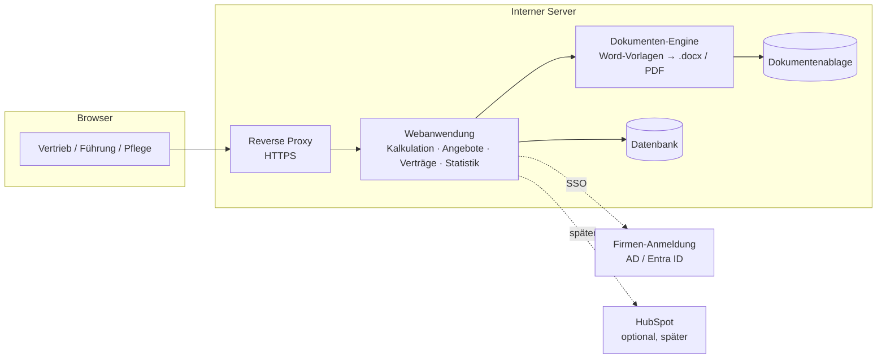

# 04 – Architektur (Vorschlag)

> Status: **Vorschlag, noch nicht entschieden.** Die endgültige Entscheidung
> wird als ADR in [docs/adr/](adr/) festgehalten, sobald die Fragen zur
> IT-Infrastruktur ([Abschnitt 6](02_offene-fragen.md#6-it-betrieb-und-infrastruktur-)) beantwortet sind.

## 1. Überblick

## 2. Empfohlener Technologie-Stack

| Baustein | Empfehlung | Begründung |
|----------|------------|------------|
| Programmiersprache / Framework | **Python mit Django** | Bringt Benutzerverwaltung, Rechte, Datenbankzugriff, Migrationen und eine fertige **Admin-Oberfläche für die Katalogpflege** mit. Bewährt, gut wartbar, große Community |
| Oberfläche | Django-Templates mit **HTMX** (Live-Berechnung ohne Neuladen), einheitliches CSS-Framework | Interaktiv genug für den Kalkulator, ohne getrenntes JavaScript-Frontend; weniger Komplexität im Betrieb |
| Word-Erzeugung | **docxtpl** (Word-Vorlagen mit Platzhaltern) | Vorlagen werden in Word gestaltet und gepflegt. Corporate Design bleibt vollständig erhalten |
| PDF und Zusammenführen | **LibreOffice headless** (Konvertierung) + pypdf | Nur falls PDF oder ein zusammengeführtes Vertragspaket gewünscht ist |
| Datenbank | **PostgreSQL** | Robust, kostenfrei, gut für Auswertungen. Alternativ bestehender SQL Server |
| Statistik / Diagramme | Auswertung in der Datenbank, Diagramme mit Chart.js | Keine zusätzliche BI-Lizenz nötig; Export nach Excel/CSV |
| Anmeldung | **Microsoft Entra ID (OIDC)** oder **LDAP gegen Active Directory** | Abhängig von Frage 6.3. Rollen über AD-Gruppen steuerbar |
| Betrieb | **Docker Compose** (App, Datenbank, Reverse Proxy) | Einfache Installation, Aktualisierung und Wiederherstellung |
| Tests | pytest, Referenzkalkulationen als Testfälle | Preisberechnung ist geschäftskritisch und muss automatisch geprüft werden |

### Betrachtete Alternativen

| Alternative | Warum (vorerst) nicht bevorzugt |
|-------------|--------------------------------|
| TypeScript (Node.js) + React | Moderner Frontend-Stack, aber getrenntes Frontend und Backend bedeuten mehr Aufwand in Entwicklung und Betrieb. Die Admin-Oberfläche müsste selbst gebaut werden |
| .NET (ASP.NET Core) | Sinnvoll, falls die interne IT stark auf Windows/.NET ausgerichtet ist. Word-Vorlagen sind etwas aufwendiger. **Neu bewerten, falls der Zielserver ein Windows Server ist** |
| Low-Code (Power Apps o. Ä.) | Schnell für einfache Formulare. Komplexe Preislogik, Word-Vorlagen und Versionierung stoßen aber an Grenzen; zudem Lizenzkosten |
| Weiterentwicklung der Excel-Lösung | Keine zentrale Datenhaltung, keine Statistik, keine Rechteverwaltung |

## 3. Modulschnitt im Code (geplant)

| Modul | Verantwortung |
|-------|---------------|
| `katalog` | Services, Preiskomponenten, Preislisten, Regeln, Textbausteine |
| `kalkulation` | Kalkulationen, Versionen, Positionen, **Rechenkern** (ohne Oberflächenbezug, voll getestet) |
| `dokumente` | Angebots- und Vertragserzeugung aus Vorlagen, Archiv |
| `statistik` | Kennzahlen, Dashboards, Exporte |
| `konten` | Anmeldung, Rollen, Rechte |

## 4. Sicherheit und Datenschutz (Grundsätze)

- Zugriff nur aus dem internen Netz; HTTPS mit internem Zertifikat.
- Anmeldung ausschließlich über Firmenkonten; keine lokalen Passwörter außer einem Notfall-Admin.
- Interne Kosten und Margen nur für berechtigte Rollen.
- Protokollierung sicherheits- und geschäftsrelevanter Aktionen.
- Keine Kundendaten im Git-Repository; Beispieldaten nur anonymisiert.
