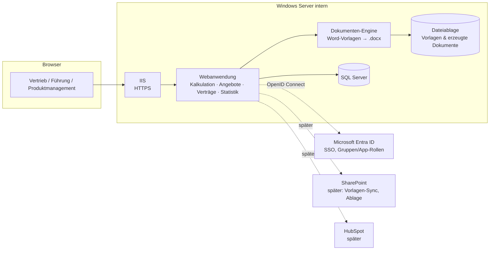

# 04 – Architektur (Vorschlag)

> Status: **Vorschlag v2 (25.09.2026), noch nicht entschieden.**
> Rahmenbedingungen: **Windows Server** im internen Netz, Anmeldung über
> **Microsoft Entra ID**. Die endgültige Entscheidung wird als ADR-0002 festgehalten,
> sobald die offene Frage 8.2 (SQL Server, Betrieb) beantwortet ist.

## 1. Überblick

## 2. Technologie-Optionen für Windows Server

Mit Windows Server als Ziel ändert sich die Empfehlung aus Version 1. Docker mit
Linux-Containern ist auf Windows Server nur umständlich zu betreiben.

| Kriterium | **Option A: ASP.NET Core (.NET, LTS)** | Option B: Python/Django |
|-----------|----------------------------------------|-------------------------|
| Hosting auf Windows Server | Nativ unter IIS, Standardfall | Möglich (IIS + Python-Prozess), weniger verbreitet |
| Entra-ID-Anmeldung | Erstklassig über Microsoft.Identity.Web | Gut über OIDC-Bibliothek (MSAL) |
| Datenbank | SQL Server (auch Express, kostenlos bis 10 GB) oder PostgreSQL | SQL Server über mssql-django oder PostgreSQL |
| Word-Vorlagen | Open XML SDK (Microsoft, kostenlos) mit Platzhaltern bzw. Inhaltssteuerelementen; etwas mehr Eigenentwicklung | docxtpl (sehr komfortabel, Schleifen/Tabellen direkt in Word) |
| Admin-Oberfläche für Katalogpflege | Selbst zu bauen (überschaubar) | Django-Admin fertig enthalten |
| Betrieb durch interne IT | Vertraut (IIS, SQL Server, Windows-Updates, Veeam-Sicherung) | Zusätzliche Laufzeitumgebung (Python) zu pflegen |
| Oberfläche | Blazor Server (interaktiv, Live-Berechnung ohne eigenes JavaScript-Framework) | Django-Templates + HTMX |

**Empfehlung: Option A (ASP.NET Core mit Blazor Server, SQL Server, IIS).**
Die Anwendung passt sich nahtlos in eine Windows-/Microsoft-Umgebung ein.
Die Anmeldung per Entra ID ist Standard. Die interne IT kann Betrieb,
Updates und Sicherung mit bekannten Werkzeugen erledigen. Der Nachteil ist, dass
Word-Vorlagen und Pflegemasken mehr Eigenentwicklung brauchen. Dem steht ein
dauerhaft einfacherer Betrieb gegenüber.

Option B wäre vorzuziehen, wenn die Pflege von Word-Vorlagen mit komplexen
Tabellen durch Fachanwender höchste Priorität hat oder wenn die Anwendung
doch auf einem Linux-Server bzw. einer Linux-VM laufen kann.

## 3. Empfohlener Stack (Option A) im Detail

| Baustein | Empfehlung |
|----------|------------|
| Laufzeit | .NET (aktuelle LTS-Version), ASP.NET Core |
| Oberfläche | Blazor Server, Komponentenbibliothek (z. B. MudBlazor, MIT-Lizenz) |
| Datenzugriff | Entity Framework Core mit Migrationen |
| Datenbank | SQL Server (bestehende Instanz oder SQL Server Express) |
| Anmeldung | Entra ID über OpenID Connect (App-Registrierung); Rollen über **App-Rollen** oder Entra-Gruppen: `Vertrieb`, `Vertriebsleitung`, `Produktmanagement`, `Fuehrung`, `Admin` |
| Word-Erzeugung | Open XML SDK; Vorlagen mit Platzhaltern bzw. Inhaltssteuerelementen; Tabellen (§ 3 Vergütung, Preistabelle) programmatisch |
| Vertragspaket | ZIP mit befüllten .docx in Rangfolge und Anlagenverzeichnis; PDF optional später über LibreOffice headless |
| Diagramme | Chart-Komponente der UI-Bibliothek oder Chart.js |
| Export | Excel über ClosedXML (MIT-Lizenz) |
| Tests | xUnit; Referenzkalkulationen ([07](07_referenzkalkulationen.md)) als Testfälle |
| Hosting | IIS auf Windows Server, HTTPS mit internem Zertifikat |
| Sicherung | SQL-Backup + Dateiablage über vorhandene Backup-Lösung |
| CI | GitHub Actions: Build, Tests, Artefakt für die Installation |

## 4. Modulschnitt im Code

| Modul | Verantwortung |
|-------|---------------|
| `Katalog` | Services, Bundles, Preiskomponenten, Preislisten, Parameter, Regeln |
| `Kalkulation` | Kalkulationen, Versionen, Positionen, Projektstatus, **Rechenkern** (ohne UI-Bezug, voll getestet), Sonderrechner S14/S60/Onboarding |
| `Dokumente` | Vorlagenverwaltung, Angebotserzeugung, Vertragspaket, Archiv, Nummernkreise |
| `Statistik` | Kennzahlen, Dashboards, Exporte, rollenabhängige Sicht |
| `Konten` | Entra-Anmeldung, Rollen, Rechte, Audit-Protokoll |

## 5. Sicherheit und Datenschutz

- Zugriff nur aus dem internen Netz (ggf. VPN); HTTPS.
- Anmeldung ausschließlich über Entra ID; kein lokales Passwort außer einem dokumentierten Notfallzugang.
- EK- und Margendaten werden serverseitig nur für berechtigte Rollen geladen.
- Protokollierung von Preisänderungen, Vorlagenwechseln, Statusänderungen und Dokumenterzeugung.
- Das Repository darf interne Preise und Vorlagen enthalten (Freigabe 25.09.2026). Kundendaten gehören nicht ins Repository.
