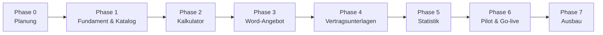

# 05 – Roadmap

> Status: **Entwurf.** Zeitangaben werden festgelegt, sobald Umfang (Anzahl
> Services, Komplexität der Preislogik) und Ressourcen bekannt sind.

## Übersicht

Ab Phase 2 entsteht nach jeder Phase ein **lauffähiger, vorführbarer Stand**.
So kann der Vertrieb früh Rückmeldung geben.

## Phase 0 – Planung (aktuell)

**Ziel:** Klarheit über Umfang, Preislogik, Dokumente und Technik.

- [x] Repository und Planungsstruktur anlegen
- [x] Referenzmaterial im SharePoint gesichtet und ausgewertet ([06_ist-analyse.md](06_ist-analyse.md))
- [x] Preislogik beschrieben und Referenzkalkulationen entworfen ([07_referenzkalkulationen.md](07_referenzkalkulationen.md))
- [x] Grundsatzentscheidungen: keine Rabatte, Projektstatus im Kalkulator, HubSpot später, Windows Server, Entra ID
- [x] Offene Fragen aus Abschnitt 8 geklärt (außer AVV, wird nachgereicht)
- [x] Offene Fragen aus Abschnitt 9 geklärt
- [ ] Offene Fragen aus Abschnitt 10 klären ([02_offene-fragen.md](02_offene-fragen.md))
- [ ] Referenzkalkulationen durch den Fachbereich bestätigen lassen
- [x] Angebotsvorlage entworfen ([08_angebotsvorlage.md](08_angebotsvorlage.md)); Abnahme des Entwurfs offen
- [ ] Rollen, Rechte und Kennzahlen final festlegen
- [x] Architekturentscheidung getroffen (ADR-0002, ADR-0003)
- [ ] Umfang von Version 1.0 festschreiben

**Ergebnis:** Freigegebenes Fachkonzept, Architekturentscheidung, Umfang v1.0.

## Phase 1 – Fundament und Servicekatalog

- Projektgerüst, automatisierte Tests und Code-Prüfung (CI), Installationspaket für IIS
- Entra-ID-Anmeldung (App-Registrierung), Rollen
- Datenmodell für Katalog, Bundles, Preislisten, Parameter, Regeln, EK-Kalkulation
- Pflegeoberfläche für den Katalog
- Erstbefüllung aus Mastersheet, Vertriebskalkulator, S14-Baukasten und EK-Kalkulation

**Ergebnis:** Katalog ist vollständig gepflegt und von der Produktverantwortung abgenommen.

## Phase 2 – Kalkulator (Modul 1)

- Rechenkern mit Tests gegen die Referenzkalkulationen
- Kalkulationsoberfläche mit Live-Berechnung und Regelprüfung (Connect-Pflicht, Bundle-Deduplizierung)
- Sonderrechner: Onboarding, Supportkontingent (S60), Server Backup (S14), Schwachstellenmanagement (S25), Cloud Server (S61), Strategische IT-Begleitung (S41)
- Freie Sonderpositionen
- Vorher/Nachher-Vergleich für Bestandskunden
- Speichern, Versionieren, Projektstatus

**Ergebnis:** Vertrieb kann kalkulieren. Die Ergebnisse stimmen mit den Referenzkalkulationen überein.

## Phase 3 – Angebotserstellung in Word (Modul 2)

- Angebotsvorlage mit Platzhaltern auf Basis des Corporate Designs
- Erzeugung, Nummernkreis, Archivierung

**Ergebnis:** Fertiges Word-Angebot per Knopfdruck.

## Phase 4 – Vertragsunterlagen (Modul 3)

- Vertragsvorlagen aus `03_Vertragswerk` mit Platzhaltern versehen (Grundvertrag § 3/§ 6, S14, S60)
- Automatische Auflösung: Bundle → enthaltene Einzel-Leistungsscheine; Rangfolge nach § 1 Abs. 3
- Paketausgabe (ZIP mit Anlagenverzeichnis)
- Versionierung der Vorlagen

**Ergebnis:** Vollständige Vertragsunterlagen per Knopfdruck.

## Phase 5 – Statistik (Modul 4)

- Dashboard mit den vereinbarten Kennzahlen, Filter, Excel-Export
- Rechteprüfung: Wer sieht welche Zahlen

**Ergebnis:** Die Führungsebene ruft Kennzahlen selbst ab.

## Phase 6 – Pilot und Go-live

- Installation auf dem internen Server, Backup und Wiederherstellung testen
- Pilotbetrieb mit ausgewählten Vertriebsmitarbeitenden
- Kurze Anleitung bzw. Schulung, Fehlerbehebung
- Produktivsetzung

## Phase 7 – Ausbau (nach Bedarf)

- HubSpot-Anbindung
- Ablage der Dokumente in SharePoint/Teams-Kundenordnern; Vorlagen-Sync aus SharePoint
- PDF-Ausgabe, weitere Vorlagen
- Anbindung an das ERP-System

## Arbeitsweise

- Anforderungen und Aufgaben als **GitHub-Issues**, gruppiert nach Phase (Meilensteine)
- Entwicklung in Feature-Branches, Übernahme per Pull Request
- Jede Architekturentscheidung als ADR in `docs/adr/`
- Preislogik-Änderungen immer mit Referenzkalkulation als Test
