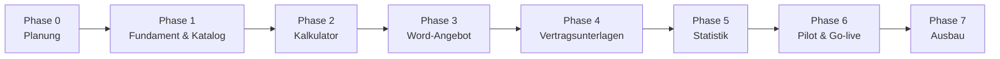

# 05 – Roadmap

> Status: **Entwurf.** Zeitangaben werden festgelegt, sobald Umfang (Anzahl
> Services, Komplexität der Preislogik) und Ressourcen bekannt sind.

## Übersicht

Ab Phase 2 entsteht nach jeder Phase ein **lauffähiger, vorführbarer Stand**.
So kann der Vertrieb früh Rückmeldung geben.

## Phase 0 – Planung (aktuell)

**Ziel:** Klarheit über Umfang, Preislogik, Dokumente und Technik.

- [x] Repository und Planungsstruktur anlegen
- [ ] Offene Fragen klären ([02_offene-fragen.md](02_offene-fragen.md))
- [ ] Referenzmaterial sammeln: aktuelle Preisliste bzw. Kalkulations-Excel, Angebotsvorlage, Vertragsvorlagen
- [ ] Preislogik aller Services fachlich beschreiben und mit 3–5 **Referenzkalkulationen** (Eingabe → erwartetes Ergebnis) belegen
- [ ] Rollen und Rechte final festlegen
- [ ] Kennzahlen für die Führungsebene festlegen
- [ ] Architekturentscheidung treffen (ADR-0002 Technologie-Stack, ADR-0003 Anmeldung)
- [ ] Anforderungen priorisieren und Umfang von Version 1.0 festschreiben

**Ergebnis:** Freigegebenes Fachkonzept, Architekturentscheidung, Umfang v1.0.

## Phase 1 – Fundament und Servicekatalog

- Projektgerüst, Docker-Setup, automatisierte Tests und Code-Prüfung (CI)
- Anmeldung an Firmenkonten, Rollen
- Datenmodell für Katalog, Preislisten, Regeln, Textbausteine
- Pflegeoberfläche für den Katalog
- Erstbefüllung mit den echten Services und Preisen

**Ergebnis:** Katalog ist vollständig gepflegt und von der Produktverantwortung abgenommen.

## Phase 2 – Kalkulator (Modul 1)

- Rechenkern mit Tests gegen die Referenzkalkulationen
- Kalkulationsoberfläche mit Live-Berechnung, Regelprüfung, Rabatten
- Speichern, Versionieren, Statusverwaltung

**Ergebnis:** Vertrieb kann kalkulieren. Die Ergebnisse stimmen mit den Referenzkalkulationen überein.

## Phase 3 – Angebotserstellung in Word (Modul 2)

- Angebotsvorlage mit Platzhaltern auf Basis des Corporate Designs
- Erzeugung, Nummernkreis, Archivierung

**Ergebnis:** Fertiges Word-Angebot per Knopfdruck.

## Phase 4 – Vertragsunterlagen (Modul 3)

- Vertragsvorlagen mit Platzhaltern, Zuordnung zu Services
- Paketausgabe (ZIP und/oder zusammengeführtes Dokument)
- Versionierung der Vorlagen

**Ergebnis:** Vollständige Vertragsunterlagen per Knopfdruck.

## Phase 5 – Statistik (Modul 4)

- Dashboard mit den vereinbarten Kennzahlen, Filter, Excel-Export
- Rechteprüfung: Wer sieht welche Zahlen

**Ergebnis:** Die Führungsebene ruft Kennzahlen selbst ab.

## Phase 6 – Pilot und Go-live

- Installation auf dem internen Server, Backup und Wiederherstellung testen
- Pilotbetrieb mit ausgewählten Vertriebsmitarbeitenden
- Kurze Anleitung bzw. Schulung, Fehlerbehebung
- Produktivsetzung

## Phase 7 – Ausbau (nach Bedarf)

- HubSpot-Anbindung
- Freigabe-Workflow für Rabatte (falls nicht in v1.0)
- PDF-Ausgabe, weitere Vorlagen
- Anbindung an das ERP-System

## Arbeitsweise

- Anforderungen und Aufgaben als **GitHub-Issues**, gruppiert nach Phase (Meilensteine)
- Entwicklung in Feature-Branches, Übernahme per Pull Request
- Jede Architekturentscheidung als ADR in `docs/adr/`
- Preislogik-Änderungen immer mit Referenzkalkulation als Test
