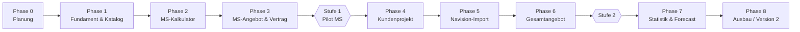

# 05 – Roadmap

> Status: **Entwurf.** Zeitangaben werden festgelegt, sobald Umfang (Anzahl
> Services, Komplexität der Preislogik) und Ressourcen bekannt sind.

## Übersicht

> Neu geordnet am 30.09.2026 nach dem Gesamtkonzept ([10_gesamtkonzept.md](10_gesamtkonzept.md)).
> Version 1 geht **in zwei Stufen** in Betrieb.

```mermaid
flowchart LR
    P0[Phase 0<br/>Planung] --> P1[Phase 1<br/>Fundament & Katalog]
    P1 --> P2[Phase 2<br/>MS-Kalkulator]
    P2 --> P3[Phase 3<br/>MS-Angebot & Vertrag]
    P3 --> S1{{Stufe 1<br/>Pilot MS}}
    S1 --> P4[Phase 4<br/>Kundenprojekt]
    P4 --> P5[Phase 5<br/>Navision-Import]
    P5 --> P6[Phase 6<br/>Gesamtangebot]
    P6 --> S2{{Stufe 2}}
    S2 --> P7[Phase 7<br/>Statistik & Forecast]
    P7 --> P8[Phase 8<br/>Ausbau / Version 2]
```

Ab Phase 2 entsteht nach jeder Phase ein **lauffähiger, vorführbarer Stand**.
So kann der Vertrieb früh Rückmeldung geben.

## Phase 0 – Planung (im Wesentlichen abgeschlossen)

**Ziel:** Klarheit über Umfang, Preislogik, Dokumente und Technik.

- [x] Repository und Planungsstruktur anlegen
- [x] Referenzmaterial im SharePoint gesichtet und ausgewertet ([06_ist-analyse.md](06_ist-analyse.md))
- [x] Preislogik beschrieben und Referenzkalkulationen entworfen ([07_referenzkalkulationen.md](07_referenzkalkulationen.md))
- [x] Grundsatzentscheidungen: keine Rabatte, Projektstatus im Kalkulator, HubSpot später, Windows Server, Entra ID
- [x] Offene Fragen aus Abschnitt 8 geklärt (außer AVV, wird nachgereicht)
- [x] Offene Fragen aus Abschnitt 9 geklärt
- [ ] Offene Fragen aus Abschnitt 10 klären ([02_offene-fragen.md](02_offene-fragen.md))
- [ ] Referenzkalkulationen durch den Fachbereich bestätigen lassen
- [x] Angebotsvorlage entworfen und abgenommen ([08_angebotsvorlage.md](08_angebotsvorlage.md))
- [x] Rollen, Rechte und Kennzahlen festgelegt (Vorschläge übernommen)
- [x] Architekturentscheidung getroffen (ADR-0002, ADR-0003)
- [x] Umfang von Version 1.0 festgeschrieben (alle Services, siehe Anforderungen)
- [x] Arbeitspakete Phase 1 als GitHub-Issues angelegt
- [x] Clickdummy vorgestellt, Feedback ausgewertet ([09_feedback-clickdummy.md](09_feedback-clickdummy.md))
- [x] Gesamtkonzept als Arbeitsstand freigegeben ([10_gesamtkonzept.md](10_gesamtkonzept.md), 29./30.09.2026)
- [ ] Gesamtkonzept im Projektmeeting mit Geschäftsführung bestätigen

**Ergebnis:** Freigegebenes Fachkonzept, Architekturentscheidung, Umfang v1.0.

## Phase 1 – Fundament und Servicekatalog

- Projektgerüst, automatisierte Tests und Code-Prüfung (CI), Installationspaket für IIS
- Entra-ID-Anmeldung (App-Registrierung), Rollen
- Datenmodell für Katalog, Bundles, Preislisten, Parameter, Regeln, EK-Kalkulation
- Pflegeoberfläche für den Katalog
- Erstbefüllung aus Mastersheet, Vertriebskalkulator, S14-Baukasten und EK-Kalkulation, mit Navision-Artikelnummern (Platzhalter laut [11_navision-zuordnung.md](11_navision-zuordnung.md))

**Ergebnis:** Katalog ist vollständig gepflegt und von der Produktverantwortung abgenommen.

**Issues:** [darntjen/kalkulator_web#1](https://github.com/darntjen/kalkulator_web/issues/1) (Übersicht) mit den Unter-Issues
[#2 Vorbereitung IT](https://github.com/darntjen/kalkulator_web/issues/2) ·
[#3 Projektgerüst](https://github.com/darntjen/kalkulator_web/issues/3) ·
[#4 Entra ID](https://github.com/darntjen/kalkulator_web/issues/4) ·
[#5 Datenmodell](https://github.com/darntjen/kalkulator_web/issues/5) ·
[#6 Pflegeoberfläche](https://github.com/darntjen/kalkulator_web/issues/6) ·
[#7 Erstbefüllung](https://github.com/darntjen/kalkulator_web/issues/7) ·
[#8 Installation und Betrieb](https://github.com/darntjen/kalkulator_web/issues/8)

## Phase 2 – Managed-Services-Kalkulator (Modul 1)

**Issue:** [darntjen/kalkulator_web#12](https://github.com/darntjen/kalkulator_web/issues/12)

- Datenmodell für Kundenprojekt (als oberstes Objekt), Kalkulation und Kalkulationsversion
- Rechenkern mit Tests gegen die Referenzkalkulationen
- Kalkulationsoberfläche mit Live-Berechnung und Regelprüfung (Connect-Pflicht, Bundle-Deduplizierung)
- Sonderrechner: Onboarding, Supportkontingent (S60), Server Backup (S14), Schwachstellenmanagement (S25), Cloud Server (S61), Strategische IT-Begleitung (S41)
- Freie Sonderpositionen mit Freigabe durch die Vertriebsleitung
- Vorher/Nachher-Vergleich für Bestandskunden
- Speichern, Duplizieren, Projektstatus

**Ergebnis:** Vertrieb kann kalkulieren. Die Ergebnisse stimmen mit den Referenzkalkulationen überein.

## Phase 3 – Managed-Services-Angebot und Vertragsunterlagen (Module 2 und 3)

**Issue:** [darntjen/kalkulator_web#13](https://github.com/darntjen/kalkulator_web/issues/13)

- Angebotsvorlage mit Platzhaltern auf Basis des Corporate Designs; Nummernkreis, Versionen, Archivierung, Versandvermerk
- Vertragsvorlagen aus `03_Vertragswerk` mit Platzhaltern (Grundvertrag § 3/§ 6, S14, S60, S61)
- Automatische Auflösung: Bundle → enthaltene Einzel-Leistungsscheine; Rangfolge nach § 1 Abs. 3; Paketausgabe
- Installation auf dem internen Server (#8), Anmeldung über Entra ID (#4)

**Ergebnis – Inbetriebnahme Stufe 1:** Pilot mit ausgewählten Vertriebsmitarbeitenden für Managed Services, kurze Einweisung, danach Produktivsetzung.

## Phase 4 – Kundenprojekt und Kundensituation

**Issue:** [darntjen/kalkulator_web#14](https://github.com/darntjen/kalkulator_web/issues/14)

- Kundenprojekt-Oberfläche mit Forecast-Feldern (Wahrscheinlichkeit, erwarteter Abschlussmonat)
- Dokumentenablage (Upload durch Vertrieb und Consultants), Rolle Consultant
- Kundensituation: Herausforderungen je Dimension
- Analyse- und Workshop-Angebote als eigene Angebotsart (Eckdaten)

**Ergebnis:** Die Pipeline ist im Kalkulator vollständig, inklusive Analyse und Workshop.

## Phase 5 – Navision-Import und Transformationsprojekte

**Issue:** [darntjen/kalkulator_web#15](https://github.com/darntjen/kalkulator_web/issues/15)

- PDF-Import (ADR), Prüfsumme, Sonderfälle (Langtexte, Alternativpositionen, Zeiträume)
- Kapitel, Art der Position, Kundentexte, Änderungen mit Kennzeichnung der Abweichung, erneuter Import
- EK manuell; Dienstleistung aus den Stundensätzen der Rollen
- Marge und DB je Transformationsprojekt
- Tests gegen synthetische Muster-PDFs

**Ergebnis:** Transformationsprojekte sind im Kalkulator aufbereitet und auswertbar.

## Phase 6 – Gesamtangebot

**Issue:** [darntjen/kalkulator_web#16](https://github.com/darntjen/kalkulator_web/issues/16)

- Gesamtangebot mit Kundensituation, Lösungsweg, Transformationsprojekten und Managed Services
- Varianten, Finanzierung/Leasing (Rate zunächst manuell), Investitionsübersicht
- Anlage mit vollständiger Positionsliste
- Erweiterte Angebotsvorlage und neues Musterangebot

**Ergebnis – Inbetriebnahme Stufe 2:** Ein ansehnliches Gesamtangebot per Knopfdruck.

## Phase 7 – Statistik und Forecast (Modul 4)

**Issue:** [darntjen/kalkulator_web#17](https://github.com/darntjen/kalkulator_web/issues/17)

- Dashboard mit Pipeline, Abschlussquote, Volumen, Verlustgründen
- Forecast nach Abschlussmonat, Marge und DB (Managed Services, Transformation, gesamt)
- Filter, Excel-Export, Rechteprüfung

Einfache Auswertungen können früher mitgeliefert werden, sobald die Daten entstehen.

**Ergebnis:** Die Führungsebene ruft Kennzahlen und Forecast selbst ab.

## Phase 8 – Ausbau und Version 2 (nach Bedarf)

- **Version 2:** KI-gestützte Angebotserstellung aus erhobenen Daten und Transkripten, auch für Analyse und Workshop; Serviceempfehlungen
- Navision: EK-Import, Übergabe von Angebot oder Auftrag
- Automatische Übernahme der Analyseergebnisse aus der Kundenakte
- HubSpot, DocBee, Paperless (Signatur), Power BI
- Margen-Ampel mit Freigabestufen, Break-even
- Ablage der Dokumente in SharePoint/Teams-Kundenordnern; PDF-Ausgabe

## Arbeitsweise

- Anforderungen und Aufgaben als **GitHub-Issues**, gruppiert nach Phase (Meilensteine)
- Entwicklung in Feature-Branches, Übernahme per Pull Request
- Jede Architekturentscheidung als ADR in `docs/adr/`
- Preislogik-Änderungen immer mit Referenzkalkulation als Test
