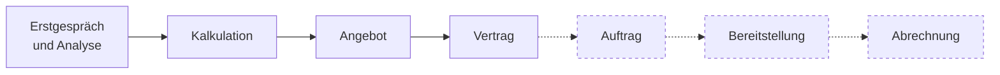
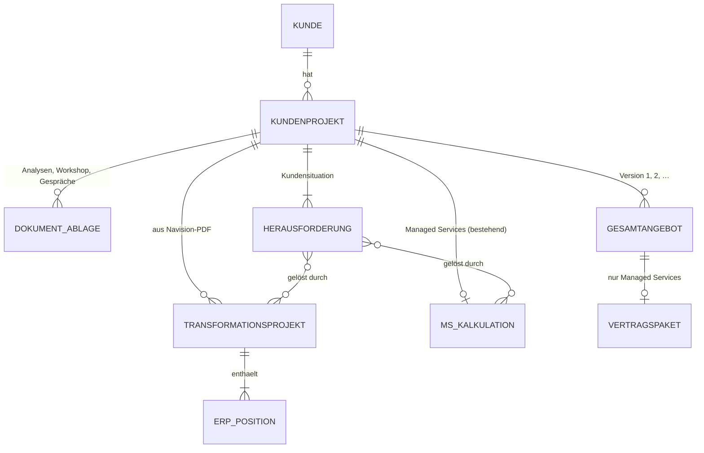
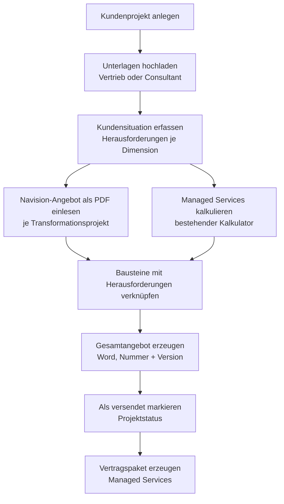

# 10 – Gesamtkonzept: Vom Kundengespräch zum Gesamtangebot

> Status: **Entwurf zur Abstimmung** (29.09.2026)
>
> Grundlage:
> - Auftrag von Dennis Arntjen vom 29.09.2026
> - Feedback zum Clickdummy ([09_feedback-clickdummy.md](09_feedback-clickdummy.md))
> - bisherige Planung (Dokumente 00–08)
>
> Nach der Abstimmung werden Projektüberblick, Anforderungen, Fachmodell und
> Roadmap angepasst (Abschnitt 11).

## 1. Worum es geht

Heute entstehen im Verkaufsprozess viele Einzelstücke: Analysen, Workshop-Ergebnisse,
Gesprächszusammenfassungen, Navision-Angebote und Word-Angebote. Sie liegen
verteilt in Teams, SharePoint, Navision und Outlook. Das Angebot an den Kunden
wird daraus jedes Mal von Hand zusammengesetzt. Das Navision-Angebot wollen wir
dem Kunden dabei am liebsten nicht zeigen.

**Ziel:** Der Kalkulator wird zur **Angebotszentrale** des Vertriebs. Je Kunde
bündelt er drei Dinge:

- die **Kundensituation**: kaufmännische, organisatorische und technische Herausforderungen
- die **Transformationsprojekte**: aus Navision eingelesen
- die **Managed Services**: im Kalkulator kalkuliert

Daraus entsteht **ein** ansehnliches, gut verständliches Angebot. Es argumentiert
von den Herausforderungen des Kunden aus, nicht von unseren Artikelnummern.

**Leitplanke für Version 1:** keine Schnittstellen. Informationen kommen als
Datei-Upload oder manuelle Eingabe herein und gehen als Word-Dokument hinaus.
Navision bleibt führend für die Kalkulation von Hardware, Software und
Dienstleistung.

## 2. Prozesskette und Einordnung der heutigen Artefakte

Leitbild ist die Kette aus dem Feedback von Matthias Erhard:

Version 1 deckt die durchgezogenen Schritte ab. Gestrichelt ist späterer Ausbau.

| Nr. | Artefakt heute | Entsteht bei | Rolle im Kalkulator v1 |
|-----|----------------|--------------|------------------------|
| 1 | Infrastrukturanalyse | Consultant / Technik | **Upload** in die Dokumentenablage des Kundenprojekts. Die Erkenntnisse übernimmt der Vertrieb manuell in die Kundensituation |
| 2 | Roadmap-Workshop (Whiteboard, Zusammenfassung) | Workshop mit dem Kunden | **Upload**. Die Roadmap-Maßnahmen sind die Quelle der Transformationsprojekte |
| 3 | Zusammenfassung IT-Standortgespräch | Vertrieb | **Upload**. Quelle für die Kundensituation |
| 4 | Angebot zu Analyse und Workshop | Vertrieb | Offene Frage 12.2: eigene Angebotsart in v1 oder weiter wie bisher |
| 5 | Erstgesprächsrecherche | Vertrieb | **Upload** als Hintergrund |
| 6 | Angebot aus Navision (ERP) | Innendienst / Vertrieb | **PDF-Import**. Positionen und Summen werden übernommen und für den Kunden aufbereitet |
| 7 | Word-Angebot zu Services und Transformation | Vertrieb | **Ergebnis** des Kalkulators: das Gesamtangebot |

## 3. Kernobjekte

| Objekt | Zweck | Wichtige Felder (Entwurf) |
|--------|-------|---------------------------|
| **Kundenprojekt** | Klammer um alles, was wir einem Kunden anbieten. Ersetzt die bisherige „Kalkulation“ als oberstes Objekt | Kunde, Titel, verantwortlicher Vertrieb, Projektstatus (wie bisher), erwarteter Abschluss, Neukunde/Bestandskunde |
| **Dokumentenablage** | Hochgeladene Unterlagen | Art (Analyse, Workshop, Standortgespräch, Recherche, Sonstiges), Datei, hochgeladen von/am |
| **Herausforderung** | Baustein der Kundensituation | Dimension (**kaufmännisch / organisatorisch / technisch**), Titel, Beschreibung in Kundensprache, Auswirkung, Priorität, Quelle (z. B. „Analyse vom …“) |
| **Transformationsprojekt** | Umsetzungsvorhaben aus der Roadmap, kalkuliert in Navision | Titel, Ziel/Nutzen in Kundensprache, Navision-Angebotsnummer, Stand des Imports, Summen einmalig, Kapitelstruktur für die Kundenansicht, erwarteter Umsetzungszeitraum |
| **ERP-Position** | Übernommene Zeile aus dem Navision-PDF | Pos., Artikelnummer, Bezeichnung, Menge, Einheit, Einzelpreis, Gesamtpreis, Art (Hardware/Software/Dienstleistung/Sonstiges), Kapitel, im Angebot einzeln oder zusammengefasst zeigen |
| **MS-Kalkulation** | Die bestehende Managed-Services-Kalkulation | unverändert laut [03_fachmodell.md](03_fachmodell.md) |
| **Gesamtangebot** | Das erzeugte Kundenangebot | Nummer, Version, enthaltene Bausteine, eingefrorene Summen, Datei, erzeugt von/am, **versendet am** |

Wichtigster Gedanke: Jeder Angebotsbaustein wird mit den Herausforderungen verknüpft,
die er löst. So kann das Angebot für jede Leistung sagen, **wofür** der Kunde sie braucht.

## 4. Arbeitsablauf in Version 1

1. **Kundenprojekt anlegen:** Kunde, Titel, erwarteter Abschluss.
2. **Unterlagen hochladen:** Consultants laden Analyseergebnisse hoch. Der Vertrieb ergänzt Workshop-Ergebnisse, Gesprächszusammenfassungen und Recherchen.
3. **Kundensituation erfassen:** Der Vertrieb trägt die Herausforderungen manuell ein, gegliedert nach kaufmännisch, organisatorisch und technisch. Die Unterlagen sind daneben einsehbar.
4. **Transformationsprojekt anlegen:** Der Vertrieb lädt das Navision-PDF hoch. Die Anwendung liest Kopf, Positionen und Summen und prüft, dass die Summe der Positionen die Angebotssumme ergibt. Danach ordnet der Vertrieb die Positionen Kapiteln zu, zum Beispiel „Neue Serverumgebung“ oder „Einrichtung und Migration“, und schreibt Ziel und Nutzen in Kundensprache.
   - **Preise ändert der Kalkulator nicht.** Ändert sich etwas, wird in Navision geändert und das PDF neu eingelesen. Die bisherige Fassung bleibt nachvollziehbar.
5. **Managed Services kalkulieren:** wie im Clickdummy.
6. **Verknüpfen:** Jeder Baustein wird einer oder mehreren Herausforderungen zugeordnet.
7. **Gesamtangebot erzeugen:** Word-Dokument mit Nummer und Version, archiviert.
8. **Versand vermerken:** Der Vertrieb markiert die Version als versendet (Datum). Der Projektstatus wechselt auf „Angebot versendet“. Das ist die Versendungsübersicht aus dem Feedback (F3).
9. **Vertragspaket erzeugen:** für den Managed-Services-Anteil, wie geplant. Transformationsprojekte werden wie bisher über Navision beauftragt.

## 5. Einlesen der Navision-Angebote

| Punkt | Festlegung |
|-------|------------|
| Format | PDF aus Navision. Das Layout ist fest (Antwort vom 29.09.2026). Deshalb ist ein regelbasiertes Auslesen ohne KI möglich |
| Werkzeug | PDF-Textextraktion in .NET (z. B. PdfPig, Apache-2.0-Lizenz). Die Entscheidung folgt als ADR |
| Übernommen | Angebotsnummer, Datum, Gültigkeit, Kundennummer, Positionen (Pos., Artikelnummer, Bezeichnung, Menge, Einheit, Einzel- und Gesamtpreis, Rabatte), Summen netto |
| Prüfung | Summe der Positionen = Angebotssumme. Bei Abweichung wird der Import mit einem Hinweis abgelehnt. Die Kundennummer wird gegen das Kundenprojekt geprüft (Warnung) |
| Bearbeiten | Kapitel, Art, Sichtbarkeit (einzeln oder zusammengefasst) und Kundentexte lassen sich bearbeiten. **Preise und Mengen nicht** |
| Neue Fassung | Erneuter Import mit derselben Angebotsnummer ersetzt die Positionen. Kapitelzuordnungen werden über die Artikelnummer übernommen, soweit möglich |
| Testbasis | Musterpdfs ohne echte Kundendaten im Repository. Echte PDFs nur lokal zum Test |

**Offener Punkt: Einkaufspreise.** Für Marge und Deckungsbeitrag eines
Transformationsprojekts braucht der Kalkulator die Einkaufspreise. Ein
Kundenangebot aus Navision enthält normalerweise nur Verkaufspreise
(Frage 12.1).

## 6. Auswertung von Transformationsprojekten und Gesamtangebot

Nur für berechtigte Rollen (Vertriebsleitung, Führung). Einkaufspreise bleiben
strikt getrennt, wie beim Managed-Services-Katalog.

| Kennzahl | Berechnung (Vorschlag) |
|----------|------------------------|
| Volumen einmalig | Summe der Transformationsprojekte + Einmalkosten Managed Services (Onboarding, S41-Roadmap) |
| Volumen laufend | MRR und ARR der Managed Services |
| Wert der Erstlaufzeit | Einmalig + 12 × MRR |
| Marge Transformationsprojekt | (VK − EK) ÷ VK, gesamt und je Art (Hardware/Software/Dienstleistung) |
| Deckungsbeitrag Gesamtangebot | DB Transformation + DB Managed Services über die Erstlaufzeit |
| Marge Gesamtangebot | DB Gesamtangebot ÷ Wert der Erstlaufzeit |
| **Forecast** | Volumen je erwartetem Abschlussmonat, getrennt nach einmalig und laufend. **Gewichtet** mit einer Wahrscheinlichkeit je Projektstatus (Frage 12.3) |
| Break-even | Noch zu definieren (Feedback F6). Vorschlag: der Monat, ab dem der laufende DB der Managed Services die einmaligen Vorleistungen gedeckt hat |

Die Statistik (Modul 4) zeigt diese Kennzahlen über alle Kundenprojekte, dazu
Pipeline, Abschlussquote und Verlustgründe wie geplant.

## 7. Aufbau des Gesamtangebots

Das Angebot erzählt die Geschichte des Kunden in dieser Reihenfolge: Situation,
Weg, Leistungen, Investition, nächste Schritte.
Die bestehende Vorlage ([08_angebotsvorlage.md](08_angebotsvorlage.md)) wird
dafür erweitert.

| Nr. | Abschnitt | Inhalt | Quelle |
|-----|-----------|--------|--------|
| – | Deckblatt, Anschreiben | wie bisher | Kundenprojekt |
| 1 | Das Wichtigste auf einen Blick | Ausgangslage in drei Sätzen, Lösung, Investition einmalig und monatlich, Start | alle Bausteine |
| 2 | Ihre Ausgangssituation | Herausforderungen nach kaufmännisch, organisatorisch, technisch | Kundensituation |
| 3 | Unser Lösungsweg | Übersicht der Bausteine mit Zeitachse (Transformation → Betrieb) und Zuordnung zu den Herausforderungen | Verknüpfungen |
| 4 | Transformationsprojekte | je Projekt: Ziel und Nutzen, Leistungsumfang nach Kapiteln, Kapitelsummen | Transformationsprojekt |
| 5 | Managed Services | Servicebasis, Leistungen, jeweils mit „löst: …“ | MS-Kalkulation |
| 6 | Investitionsübersicht | einmalig, monatlich, Wert der Erstlaufzeit | Rechenkern |
| 7 | Rahmen und nächste Schritte | Gültigkeit, Vertragsbestandteile, Beauftragungsweg | Parameter |
| Anlage | Positionsliste | vollständige Positionen der Navision-Angebote (Frage 12.5) | ERP-Positionen |

Angebote, die nur Managed Services oder nur ein Transformationsprojekt
enthalten, sind möglich. Die leeren Abschnitte entfallen dann.

## 8. Rollen (Ergänzung)

| Rolle | Neu / geändert |
|-------|----------------|
| **Consultant** | **Neu.** Sieht Kundenprojekte und Kalkulationen. Lädt Analyseergebnisse hoch. Kalkuliert nicht, erzeugt keine Angebote, sieht keine Einkaufspreise |
| Vertrieb | Zusätzlich: Kundenprojekte, Kundensituation, Navision-Import, Gesamtangebot |
| Vertriebsleitung, Führung | Zusätzlich: Marge und Forecast der Transformationsprojekte |

Die übrigen Rollen bleiben wie in [00_projektueberblick.md](00_projektueberblick.md).

## 9. Umfang: Version 1 und später

| Thema | Version 1 | Später |
|-------|-----------|--------|
| Analyseergebnisse | Upload, manuelle Übernahme | automatische Übernahme aus der Kundenakte (festes Format mit der Technik abstimmen) |
| Navision | PDF-Import (nur lesen) | Angebot oder Auftrag an Navision übergeben |
| Managed Services | vollständig wie geplant | – |
| Angebot | Word, Nummer, Version, Versandvermerk | PDF, Versand aus der Anwendung |
| Vertrag | Vertragspaket Managed Services | DocBee, Paperless (Signatur) |
| Freigaben | Sonderpositionen durch die Vertriebsleitung | Margen-Ampel mit Stufen Vertrieb / VL / GL |
| Auswertung | Statistik, Marge, Forecast, Excel-Export | Power BI |
| Empfehlungen | – | Regel- oder KI-basierte Vorschläge (z. B. NIS2 → Security) |
| CRM | – | HubSpot |

## 10. Technische Auswirkungen

- **Dateiablage** für hochgeladene Unterlagen auf dem Server, Metadaten in SQL Server. Braucht Speicherplatz, Datensicherung und ein Lösch- und Aufbewahrungskonzept (DSGVO, F-06).
- **PDF-Import** als eigenes Modul mit Tests gegen Muster-PDFs.
- **Datenmodell:** „Kundenprojekt“ wird das oberste Objekt. Die bestehende Kalkulation hängt darunter. Die Katalog-Migration aus #5 ist davon nicht betroffen, weil die Kalkulationstabellen noch nicht angelegt sind.
- **Keine Daten nach außen:** Der Import arbeitet regelbasiert. Es werden keine Kundendaten an KI-Dienste übermittelt.

## 11. Folgeänderungen nach Abstimmung

- [00_projektueberblick.md](00_projektueberblick.md): Scope (Import von Transformationsprojekten statt „Projekte nicht im Scope“), Rolle Consultant, Vision
- [01_anforderungen.md](01_anforderungen.md): neue Abschnitte Kundenprojekt und Kundensituation, Navision-Import, Gesamtangebot, Forecast. Anpassung von B-08 und C-01 bis C-07
- [03_fachmodell.md](03_fachmodell.md): Objekte aus Abschnitt 3
- [05_roadmap.md](05_roadmap.md): neue Phasen, Vorschlag:
  1. Phase 2: Managed-Services-Kalkulator
  2. Phase 3: Kundenprojekt, Kundensituation, Dokumentenablage
  3. Phase 4: Navision-Import und Auswertung
  4. Phase 5: Gesamtangebot (Word)
  5. Phase 6: Vertragsunterlagen
  6. Phase 7: Statistik und Forecast
  7. Phase 8: Pilot
- [08_angebotsvorlage.md](08_angebotsvorlage.md): Aufbau laut Abschnitt 7, neues Musterangebot
- neue ADRs: PDF-Import, Dateiablage

## 12. Offene Fragen

| Nr. | Frage | Warum wichtig |
|-----|-------|---------------|
| 12.1 | **Enthält das Navision-PDF Einkaufspreise**, oder gibt es einen internen Ausdruck mit EK und DB? Falls nicht: Sollen EK je Position oder je Kapitel manuell erfasst werden? | Marge und DB der Transformationsprojekte |
| 12.2 | Soll das **Angebot zu Analyse und Workshop** (Artefakt 4) in v1 eine eigene Angebotsart im Kalkulator werden? | Umfang v1 |
| 12.3 | **Forecast:** feste Wahrscheinlichkeit je Projektstatus (z. B. Entwurf 10 %, Angebot versendet 30 %, Vertrag erstellt 70 %) oder manuell je Kundenprojekt? | Aussagekraft der Statistik |
| 12.4 | Kann ein Gesamtangebot **Varianten** enthalten, z. B. zwei Navision-Angebote für dieselbe Lieferung, aus denen der Kunde wählt? | Aufbau von Angebot und Summen |
| 12.5 | Soll die **vollständige Positionsliste** aus Navision als Anlage ins Angebot, oder reichen Kapitelsummen? | Transparenz vs. Lesbarkeit |
| 12.6 | Bitte **zwei bis drei Navision-Angebots-PDFs** als Muster bereitstellen (gerne mit Hardware, Software und Dienstleistung, eines mit Rabattzeile) | Entwicklung und Tests des Imports |
| 12.7 | Gehören **Leasing und Finanzierung** in v1 dazu, z. B. Monatsrate statt Kaufpreis? | Umfang v1 |
