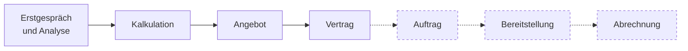
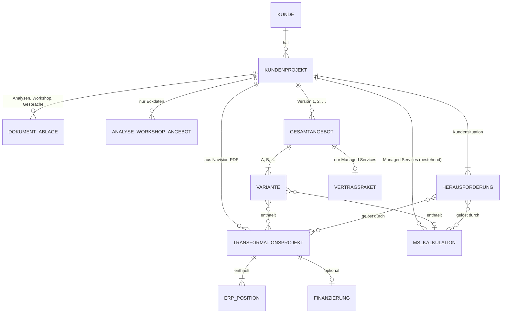
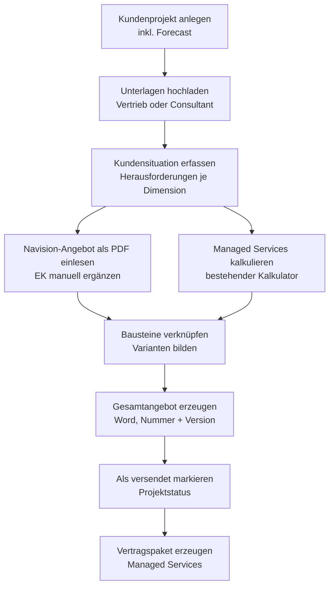

# 10 – Gesamtkonzept: Vom Kundengespräch zum Gesamtangebot

> Status: **Entwurf v2 zur Abstimmung** (29.09.2026)
>
> - v1: Erster Entwurf.
> - v2: Antworten auf die offenen Fragen eingearbeitet, Auswertung von zwei echten Navision-Angeboten ergänzt.
>
> Grundlage:
> - Auftrag von Dennis Arntjen vom 29.09.2026
> - Feedback zum Clickdummy ([09_feedback-clickdummy.md](09_feedback-clickdummy.md))
> - bisherige Planung (Dokumente 00–08)
>
> Nach der Abstimmung werden Projektüberblick, Anforderungen, Fachmodell und
> Roadmap angepasst (Abschnitt 12).

## 1. Worum es geht

Heute entstehen im Verkaufsprozess viele Einzelstücke: Analysen, Workshop-Ergebnisse,
Gesprächszusammenfassungen, Navision-Angebote und Word-Angebote. Sie liegen
verteilt in Teams, SharePoint, Navision und Outlook. Das Angebot an den Kunden
wird daraus jedes Mal von Hand zusammengesetzt. Das Navision-Angebot wollen wir
dem Kunden dabei am liebsten nicht zeigen.

**Ziel:** Der Kalkulator wird zur **Angebotszentrale** des Vertriebs. Je Kunde
bündelt er drei Dinge:

- die **Kundensituation**: kaufmännische, organisatorische und technische Herausforderungen
- die **Transformationsprojekte**: aus Navision eingelesen
- die **Managed Services**: im Kalkulator kalkuliert

Daraus entsteht **ein** ansehnliches, gut verständliches Angebot. Es argumentiert
von den Herausforderungen des Kunden aus, nicht von unseren Artikelnummern.
Zusätzlich hält der Kalkulator die **Pipeline** vollständig. Dazu gehören auch
Angebote, die weiterhin außerhalb entstehen, etwa Analyse und Workshop.

**Leitplanken für Version 1:**

- **Keine Schnittstellen.** Informationen kommen als Datei-Upload oder manuelle Eingabe herein und gehen als Word-Dokument hinaus.
- **Navision bleibt führend** für die Kalkulation von Hardware, Software und Dienstleistung.
- **Keine KI in v1.** Die KI-gestützte Angebotserstellung aus erhobenen Daten und Transkripten ist für **Version 2** vorgesehen. v1 legt dafür saubere, strukturierte Daten an.

## 2. Prozesskette und Einordnung der heutigen Artefakte

Leitbild ist die Kette aus dem Feedback von Matthias Erhard:

Version 1 deckt die durchgezogenen Schritte ab. Gestrichelt ist späterer Ausbau.

| Nr. | Artefakt heute | Entsteht bei | Rolle im Kalkulator v1 |
|-----|----------------|--------------|------------------------|
| 1 | Infrastrukturanalyse | Consultant / Technik | **Upload** in die Dokumentenablage des Kundenprojekts. Die Erkenntnisse übernimmt der Vertrieb manuell in die Kundensituation |
| 2 | Roadmap-Workshop (Whiteboard, Zusammenfassung) | Workshop mit dem Kunden | **Upload**. Die Roadmap-Maßnahmen sind die Quelle der Transformationsprojekte |
| 3 | Zusammenfassung IT-Standortgespräch | Vertrieb | **Upload**. Quelle für die Kundensituation |
| 4 | Angebot zu Analyse und Workshop | Vertrieb, per Claude-Skill | **Eigene Angebotsart.** Das Dokument entsteht weiter per Skill. Im Kalkulator werden nur die Eckdaten erfasst (Abschnitt 7) und das Dokument optional abgelegt. So bleibt die Pipeline auswertbar |
| 5 | Erstgesprächsrecherche | Vertrieb | **Upload** als Hintergrund |
| 6 | Angebot aus Navision (ERP) | Innendienst / Vertrieb | **PDF-Import**. Positionen und Summen werden übernommen und für den Kunden aufbereitet (Abschnitt 5) |
| 7 | Word-Angebot zu Services und Transformation | Vertrieb | **Ergebnis** des Kalkulators: das Gesamtangebot |

## 3. Kernobjekte

| Objekt | Zweck | Wichtige Felder (Entwurf) |
|--------|-------|---------------------------|
| **Kundenprojekt** | Klammer um alles, was wir einem Kunden anbieten. Ersetzt die bisherige „Kalkulation“ als oberstes Objekt | Kunde (mit Navision-Kundennummer), Titel, verantwortlicher Vertrieb, Projektstatus (wie bisher), Neukunde/Bestandskunde, **Forecast: Abschlusswahrscheinlichkeit in % und erwarteter Abschlussmonat, beides manuell** |
| **Dokumentenablage** | Hochgeladene Unterlagen | Art (Analyse, Workshop, Standortgespräch, Recherche, Angebot Analyse/Workshop, Sonstiges), Datei, hochgeladen von/am |
| **Herausforderung** | Baustein der Kundensituation | Dimension (**kaufmännisch / organisatorisch / technisch**), Titel, Beschreibung in Kundensprache, Auswirkung, Priorität, Quelle (z. B. „Analyse vom …“) |
| **Analyse-/Workshop-Angebot** | Eckdaten für die Pipeline | Angebotsnummer, Datum, Paketpreis, Status (versendet/beauftragt/abgelehnt), abgelegtes Dokument |
| **Transformationsprojekt** | Umsetzungsvorhaben aus der Roadmap, kalkuliert in Navision | Titel, Ziel und Nutzen in Kundensprache, Navision-Angebotsnummer, importierte Fassung, Kapitelstruktur, erwarteter Umsetzungszeitraum |
| **ERP-Position** | Übernommene Zeile aus dem Navision-PDF | Pos., Artikelnummer, Bezeichnung, Langtext, Menge, Einheit, VK-Preis, Betrag, Art der Position (Abschnitt 5.3), Kapitel, Sichtbarkeit im Angebot, **EK je Einheit (manuell)** |
| **Finanzierung** | Leasing oder Finanzierung eines Transformationsprojekts | Art, Laufzeit, Rate, Partner (Details offen, Abschnitt 8) |
| **MS-Kalkulation** | Die bestehende Managed-Services-Kalkulation | unverändert laut [03_fachmodell.md](03_fachmodell.md). Pro Kundenprojekt mehrere möglich (für Varianten) |
| **Gesamtangebot** | Das erzeugte Kundenangebot | Nummer, Version, Varianten, eingefrorene Summen, Datei, erzeugt von/am, **versendet am** |
| **Variante** | Wahlmöglichkeit für den Kunden, z. B. „A: Kauf“, „B: Leasing“ oder „A: Standard, B: Premium“ | Bezeichnung, enthaltene Bausteine, Summen je Variante |

Wichtigster Gedanke: Jeder Angebotsbaustein wird mit den Herausforderungen verknüpft,
die er löst. So kann das Angebot für jede Leistung sagen, **wofür** der Kunde sie braucht.

## 4. Arbeitsablauf in Version 1

1. **Kundenprojekt anlegen:** Kunde mit Navision-Kundennummer, Titel. Der Vertrieb pflegt Abschlusswahrscheinlichkeit und erwarteten Abschlussmonat und hält beides aktuell.
2. **Unterlagen hochladen:** Consultants laden Analyseergebnisse hoch. Der Vertrieb ergänzt Workshop-Ergebnisse, Gesprächszusammenfassungen und Recherchen.
3. **Kundensituation erfassen:** Der Vertrieb trägt die Herausforderungen manuell ein, gegliedert nach kaufmännisch, organisatorisch und technisch. Die Unterlagen sind daneben einsehbar.
4. **Transformationsprojekt anlegen:** Der Vertrieb lädt das Navision-PDF hoch.
   - Die Anwendung liest Kopf, Positionen und Summen und prüft die Summe.
   - Danach ordnet der Vertrieb die Positionen Kapiteln zu, zum Beispiel „Neue Firewall“ oder „Einrichtung und Migration“, und schreibt Ziel und Nutzen in Kundensprache.
   - Die Einkaufspreise trägt er manuell nach (Abschnitt 6).
   - **Preise und Mengen ändert der Kalkulator nicht.** Ändert sich etwas, wird in Navision geändert und das PDF neu eingelesen.
5. **Managed Services kalkulieren:** wie im Clickdummy.
6. **Verknüpfen und Varianten bilden:** Jeder Baustein wird einer oder mehreren Herausforderungen zugeordnet. Bei Bedarf werden Varianten angelegt, etwa Kauf gegen Leasing oder zwei Ausbaustufen.
7. **Gesamtangebot erzeugen:** Word-Dokument mit Nummer und Version, archiviert. Die vollständige Positionsliste hängt als Anlage an.
8. **Versand vermerken:** Der Vertrieb markiert die Version als versendet (Datum). Der Projektstatus wechselt auf „Angebot versendet“. Das ist die Versendungsübersicht aus dem Feedback (F3).
9. **Vertragspaket erzeugen:** für den Managed-Services-Anteil, wie geplant. Transformationsprojekte werden wie bisher über Navision beauftragt.

## 5. Einlesen der Navision-Angebote

### 5.1 Befund aus zwei echten Angeboten (29.09.2026)

Ausgewertet wurden ein Hardware- und Dienstleistungsangebot (4 Seiten, 19
Positionen) und ein Managed-Services-Angebot (2 Seiten, 16 Positionen) für
denselben Kunden. Die Dateien liegen **nicht** im Repository, weil sie echte
Kundendaten enthalten.

| Merkmal | Befund | Folge für den Import |
|---------|--------|----------------------|
| Erzeugung | Microsoft Reporting Services, echte Textebene | Regelbasiertes Auslesen ohne Texterkennung möglich |
| Kopf | „Angebot AN……“, Belegdatum, Kundennummer, „Ihre Referenz“, Ansprechpartner mit Telefon und E-Mail, Anschrift | Wird übernommen. Die Kundennummer wird gegen das Kundenprojekt geprüft |
| Gültigkeit | **nicht enthalten** | Gültigkeit setzt der Kalkulator im Gesamtangebot |
| Spalten | Pos. · Beschreibung · Menge · Einheit · VK-Preis · Betrag | Zuordnung über die Spaltenposition auf der Seite |
| Artikelnummern | Hardware und Software laufen oft über einen **Sammelartikel** (z. B. 10200100). Dienstleistung hat eigene Artikel mit AE-Einheiten (1 AE = 15 Min.) | Die Art der Position lässt sich nur bei Dienstleistung und Managed Services aus der Artikelnummer ableiten. Sonst ordnet der Vertrieb zu |
| Langtexte | Mehrzeilige Beschreibungen und Leistungsumfänge, auch über Seitengrenzen hinweg | Langtext gehört zur vorigen Position. Seitenkopf und Fußzeile werden herausgefiltert |
| Positionen ohne Preis | Kommen vor (z. B. inklusive Bestandteile) | Werden als „inklusive“ übernommen, Betrag 0 |
| Alternativpositionen | „Alternativposition: 14.1“ mit Preis, aber ohne Betrag, nicht in der Summe | Werden als Alternative übernommen, nicht summiert. Sie können im Angebot als Option erscheinen |
| Zeiträume | „Zeitraum: 30.10.2026 – 29.01.2028 (1Y)“ bei Laufzeitprodukten | Werden als Laufzeitangabe zur Position erkannt |
| Summen | Total netto, MwSt., Total brutto | Prüfsumme. Die Summe der Beträge muss Total netto ergeben. Im Hardware-Angebot passt das exakt (46.808,15 €) |
| Managed Services in Navision | Bundle-Zeile mit Preis ohne eigene Positionsnummer, darunter die Bestandteile als Positionen „Pauschale“ ohne Preis. Artikel 9825xxxx je Service, Onboarding 98010691 | Siehe 5.4 |
| Monatlich und einmalig | Die Navision-Summe mischt Monatspreise und Onboarding (2.448,80 € = 1.548,80 € monatlich + 900,00 € einmalig) | Der Kalkulator trennt beides. Die Navision-Summe allein ist für den Kunden irreführend |

### 5.2 Ablauf und Regeln

| Punkt | Festlegung |
|-------|------------|
| Format | PDF aus Navision. Das Layout ist fest (Antwort vom 29.09.2026) |
| Werkzeug | PDF-Textextraktion mit Koordinaten in .NET (z. B. PdfPig, Apache-2.0-Lizenz). Die Entscheidung folgt als ADR |
| Prüfung | Summe der Positionen = Total netto, sonst wird der Import mit Hinweis abgelehnt. Die Kundennummer wird gegen das Kundenprojekt geprüft (Warnung) |
| Bearbeiten | Kapitel, Art, Sichtbarkeit (einzeln oder zusammengefasst), Kundentexte und EK lassen sich bearbeiten. **Preise und Mengen nicht** |
| Neue Fassung | Erneuter Import mit derselben Angebotsnummer ersetzt die Positionen. Kapitel, Art und EK werden über Positionsnummer und Artikelnummer übernommen, soweit möglich. Die alte Fassung bleibt einsehbar |
| Testbasis | **Synthetische** Muster-PDFs im selben Layout, ohne echte Kundendaten, im Repository. Echte PDFs nur lokal |

### 5.3 Art der Position

| Art | Erkennung | Bedeutung |
|-----|-----------|-----------|
| Hardware | manuell (Sammelartikel) | einmalig |
| Software / Lizenz | manuell | einmalig oder mit Laufzeit |
| Herstellerservice / Garantie | manuell, Hinweis bei „Zeitraum“ oder „Support“ | einmalig mit Laufzeit |
| Dienstleistung | automatisch über Artikelnummer und Einheit AE | einmalig. EK kann automatisch berechnet werden (Abschnitt 6) |
| Managed Service | automatisch über Artikelnummer 9825xxxx | monatlich |
| Onboarding | automatisch über Artikelnummer | einmalig |
| Sonstiges | manuell (z. B. Kabel, Versand) | einmalig |

Die Zuordnung von Artikelnummern zu Arten pflegt das Produktmanagement in einer Tabelle.

### 5.4 Managed Services aus Navision

Navision kennt die Managed Services mit eigenen Artikelnummern. Die Preise im
Beispiel stimmen mit dem Katalog überein (z. B. B07 Switch 49,90 €, AP 41,90 €,
Onboarding Standard XS 900 €). Daraus folgt:

- Jeder Service und jede Preiskomponente im Katalog bekommt die **Navision-Artikelnummer** als Feld. Das kostet wenig und ist die Grundlage für die spätere Übergabe an Navision.
- **Führend für Managed Services bleibt der Kalkulator.** Ein Navision-Angebot mit Managed Services wird nicht als Transformationsprojekt eingelesen. Optional kann der Kalkulator es mit der Managed-Services-Kalkulation abgleichen und Abweichungen bei Preisen und Mengen melden.
- Beobachtung: Navision schreibt beim Onboarding „bis 30 AP“, der Katalog zählt User (Entscheidung 25.09.2026). Das sollte in Navision vereinheitlicht werden.

## 6. Einkaufspreise, Marge und Forecast

Nur für berechtigte Rollen (Vertriebsleitung, Führung). Einkaufspreise bleiben
strikt getrennt, wie beim Managed-Services-Katalog.

**Einkaufspreise in v1 (Entscheidung 29.09.2026):** Das Navision-PDF enthält
keine EK. Sie werden **manuell** gepflegt. Wie sie später importiert werden,
klärt Dennis.

- Standard: EK je Einheit an der Position.
- Erleichterung: EK als Summe je Kapitel, wenn Einzelwerte fehlen.
- **Dienstleistung automatisch:** Positionen mit AE-Einheit erhalten den EK aus dem internen Kostensatz des Katalogs (Parameter `EK_KOSTENSATZ_PRO_STUNDE` ÷ 4 je AE). Überschreiben ist möglich.
- Positionen ohne EK werden sichtbar markiert. Die Marge des Projekts gilt dann als „unvollständig“.

| Kennzahl | Berechnung (Vorschlag) |
|----------|------------------------|
| Volumen einmalig | Summe der Transformationsprojekte + Einmalkosten Managed Services (Onboarding, S41-Roadmap) |
| Volumen laufend | MRR und ARR der Managed Services |
| Wert der Erstlaufzeit | Einmalig + 12 × MRR |
| Marge Transformationsprojekt | (VK − EK) ÷ VK, gesamt und je Art |
| Deckungsbeitrag Gesamtangebot | DB Transformation + DB Managed Services über die Erstlaufzeit |
| Marge Gesamtangebot | DB Gesamtangebot ÷ Wert der Erstlaufzeit |
| **Forecast** | Volumen je erwartetem Abschlussmonat, getrennt nach einmalig und laufend, **gewichtet mit der manuell gepflegten Wahrscheinlichkeit** des Kundenprojekts. Bei Varianten zählt die Variante, die der Vertrieb als wahrscheinlich markiert |
| Break-even | Noch zu definieren (Feedback F6). Vorschlag: der Monat, ab dem der laufende DB der Managed Services die einmaligen Vorleistungen gedeckt hat |

Die Statistik (Modul 4) zeigt diese Kennzahlen über alle Kundenprojekte,
einschließlich der Analyse- und Workshop-Angebote. Dazu kommen Pipeline,
Abschlussquote und Verlustgründe wie geplant.

## 7. Angebotsarten

| Angebotsart | Erstellung in v1 | Im Kalkulator |
|-------------|------------------|---------------|
| **Analyse und Workshop** | weiter per Claude-Skill | Eckdaten erfassen (Nummer, Datum, Paketpreis, Status), Dokument optional ablegen. Zählt in Pipeline und Statistik |
| **Gesamtangebot** (Transformation und/oder Managed Services, mit Varianten) | im Kalkulator | vollständig |

Version 2 holt die Erstellung des Analyse- und Workshop-Angebots in den
Kalkulator, wenn die KI-Integration kommt.

## 8. Leasing und Finanzierung

**Entscheidung 29.09.2026:** Leasing und Finanzierung gehören grundsätzlich dazu.
Im Angebot erscheint die Finanzierung als **eigene Variante**, zum Beispiel
„Variante A: Kauf 46.808,15 € einmalig“ und „Variante B: Leasing 36 Monate, x € monatlich“.

Vorschlag für die Rechnung:

- Finanzierungsbetrag = VK der ausgewählten Positionen, z. B. Hardware und Software, ggf. mit Dienstleistung.
- Rate = Finanzierungsbetrag × Faktor. Der Faktor kommt je Laufzeit aus einer Faktortabelle, die das Produktmanagement pflegt, oder wird je Angebot vom Partner übernommen.
- Die Rate wird im Angebot mit den Managed Services zu einer **monatlichen Gesamtbelastung** zusammengefasst.

Die Details sind offen (Fragen 13.1 bis 13.4). Bis dahin plant das Konzept die
Finanzierung als Variante mit manuell eingetragener Rate. Das funktioniert
unabhängig davon, wie die Rate zustande kommt.

## 9. Aufbau des Gesamtangebots

Das Angebot erzählt die Geschichte des Kunden in dieser Reihenfolge: Situation,
Weg, Leistungen, Investition, nächste Schritte.
Die bestehende Vorlage ([08_angebotsvorlage.md](08_angebotsvorlage.md)) wird
dafür erweitert.

| Nr. | Abschnitt | Inhalt | Quelle |
|-----|-----------|--------|--------|
| – | Deckblatt, Anschreiben | wie bisher | Kundenprojekt |
| 1 | Das Wichtigste auf einen Blick | Ausgangslage in drei Sätzen, Lösung, Investition einmalig und monatlich je Variante, Start | alle Bausteine |
| 2 | Ihre Ausgangssituation | Herausforderungen nach kaufmännisch, organisatorisch, technisch | Kundensituation |
| 3 | Unser Lösungsweg | Übersicht der Bausteine mit Zeitachse (Transformation → Betrieb) und Zuordnung zu den Herausforderungen | Verknüpfungen |
| 4 | Transformationsprojekte | je Projekt: Ziel und Nutzen, Leistungsumfang nach Kapiteln, Kapitelsummen, Optionen aus Alternativpositionen | Transformationsprojekt |
| 5 | Managed Services | Servicebasis, Leistungen, jeweils mit „löst: …“ | MS-Kalkulation |
| 6 | Investitionsübersicht | je Variante: einmalig, monatlich, ggf. Leasingrate, Wert der Erstlaufzeit | Rechenkern |
| 7 | Rahmen und nächste Schritte | Gültigkeit, Vertragsbestandteile, Beauftragungsweg | Parameter |
| Anlage | **Vollständige Positionsliste** (Entscheidung 29.09.2026) | alle Positionen der Navision-Angebote mit Navision-Angebotsnummer, damit die Beauftragung eindeutig zugeordnet werden kann | ERP-Positionen |

Angebote, die nur Managed Services oder nur ein Transformationsprojekt
enthalten, sind möglich. Die leeren Abschnitte entfallen dann.

## 10. Rollen (Ergänzung)

| Rolle | Neu / geändert |
|-------|----------------|
| **Consultant** | **Neu.** Sieht Kundenprojekte und Kalkulationen. Lädt Analyseergebnisse hoch. Kalkuliert nicht, erzeugt keine Angebote, sieht keine Einkaufspreise |
| Vertrieb | Zusätzlich: Kundenprojekte, Kundensituation, Navision-Import, Gesamtangebot, Analyse-/Workshop-Angebote, Forecast. Pflegt EK der Transformationsprojekte, sieht aber keine EK der Managed Services (Frage 13.5) |
| Vertriebsleitung, Führung | Zusätzlich: Marge und Forecast aller Kundenprojekte |

Die übrigen Rollen bleiben wie in [00_projektueberblick.md](00_projektueberblick.md).

## 11. Umfang: Version 1 und später

| Thema | Version 1 | Später |
|-------|-----------|--------|
| Analyseergebnisse | Upload, manuelle Übernahme | automatische Übernahme aus der Kundenakte |
| Angebot Analyse/Workshop | Eckdaten, Erstellung per Skill | Erstellung im Kalkulator mit KI (v2) |
| Navision | PDF-Import (nur lesen), EK manuell | EK-Import. Angebot oder Auftrag an Navision übergeben |
| Managed Services | vollständig wie geplant, mit Navision-Artikelnummern | – |
| Angebot | Word mit Varianten und Anlage, Nummer, Version, Versandvermerk | PDF, Versand aus der Anwendung, KI-gestützte Texte (v2) |
| Finanzierung | Variante mit Rate (Rechenweg laut Abschnitt 8) | Anbindung an den Leasingpartner |
| Vertrag | Vertragspaket Managed Services | DocBee, Paperless (Signatur) |
| Freigaben | Sonderpositionen durch die Vertriebsleitung | Margen-Ampel mit Stufen Vertrieb / VL / GL |
| Auswertung | Statistik, Marge, Forecast, Excel-Export | Power BI |
| Empfehlungen | – | KI-Vorschläge (z. B. NIS2 → Security) |
| CRM | – | HubSpot |

## 12. Technische Auswirkungen und Folgeänderungen

**Technik:**

- **Dateiablage** für hochgeladene Unterlagen auf dem Server, Metadaten in SQL Server. Braucht Speicherplatz, Datensicherung und ein Lösch- und Aufbewahrungskonzept (DSGVO, F-06).
- **PDF-Import** als eigenes Modul mit Tests gegen synthetische Muster-PDFs.
- **Datenmodell:**
  - „Kundenprojekt“ wird das oberste Objekt. Die bestehende Kalkulation hängt darunter.
  - Der Katalog bekommt Navision-Artikelnummern.
  - Die Katalog-Migration aus #5 ist davon nur um dieses Feld betroffen, weil die Kalkulationstabellen noch nicht angelegt sind.
- **Keine Daten nach außen in v1.** Der Import arbeitet regelbasiert. Für die KI-Integration in v2 wird eine eigene Datenschutz- und Architekturentscheidung nötig.

**Folgeänderungen nach Abstimmung:**

- [00_projektueberblick.md](00_projektueberblick.md): Vision, Scope (Transformationsprojekte per Import, Finanzierung), Rolle Consultant
- [01_anforderungen.md](01_anforderungen.md): neue Abschnitte Kundenprojekt und Kundensituation, Navision-Import, Gesamtangebot mit Varianten, Finanzierung, Forecast, Angebotsart Analyse/Workshop. Anpassung von B-08 und C-01 bis C-07
- [03_fachmodell.md](03_fachmodell.md): Objekte aus Abschnitt 3
- [05_roadmap.md](05_roadmap.md): neue Phasen, Vorschlag:
  1. Phase 2: Managed-Services-Kalkulator
  2. Phase 3: Kundenprojekt, Kundensituation, Dokumentenablage, Analyse-/Workshop-Angebote
  3. Phase 4: Navision-Import, EK und Auswertung
  4. Phase 5: Gesamtangebot mit Varianten und Finanzierung (Word)
  5. Phase 6: Vertragsunterlagen
  6. Phase 7: Statistik und Forecast
  7. Phase 8: Pilot
- [08_angebotsvorlage.md](08_angebotsvorlage.md): Aufbau laut Abschnitt 9, neues Musterangebot
- neue ADRs: PDF-Import, Dateiablage

## 13. Offene Fragen

Beantwortet am 29.09.2026:

- Navision-PDF ohne EK → EK manuell in v1
- Analyse/Workshop → eigene Angebotsart, Erstellung weiter per Skill
- Forecast → manuell je Kundenprojekt
- Varianten → ja
- Positionsliste → als Anlage
- Leasing und Finanzierung → gehören dazu
- Muster-PDFs → zwei Angebote bereitgestellt

| Nr. | Frage | Warum wichtig |
|-----|-------|---------------|
| 13.1 | **Leasing:** Mit welchen Partnern arbeiten wir, und wer rechnet heute die Rate aus (z. B. Fabian)? Gibt es feste Faktoren je Laufzeit, oder kommt jedes Mal ein individuelles Angebot des Partners? | Rechenweg der Finanzierungsvariante |
| 13.2 | **Finanzierung:** Welche Formen gibt es außer Leasing, z. B. Mietkauf, eigene Vorfinanzierung oder Ratenzahlung über Nösse? | Umfang des Moduls |
| 13.3 | Welche Positionen dürfen finanziert werden? Nur Hardware und Software oder auch Dienstleistung? | Rechenweg |
| 13.4 | Soll die Leasingrate im Angebot mit den Managed Services zu **einer** Monatsrate zusammengefasst werden („IT als monatliche Pauschale“)? | Aufbau des Angebots |
| 13.5 | Der Vertrieb pflegt die EK der Transformationsprojekte und sieht sie damit. Soll er auch die daraus berechnete Marge sehen? Bei Managed Services sieht er sie bisher nicht | Rechtekonzept |
| 13.6 | Darf ich **synthetische** Muster-PDFs im Navision-Layout mit erfundenen Kunden und Positionen für die automatischen Tests anlegen? | Testbasis ohne echte Kundendaten |
