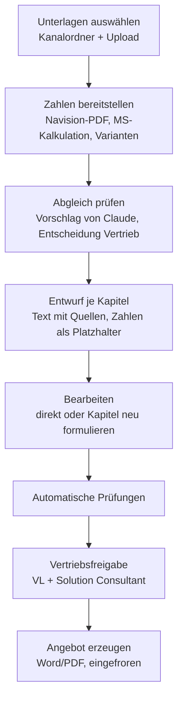

# 13 – KI-gestützte Angebotserstellung

> Status: **Entwurf** (04.10.2026) · baut auf dem Gesamtkonzept ([10_gesamtkonzept.md](10_gesamtkonzept.md)) auf
>
> Grundlage:
> - die Claude-Skills `angebotserstellung-roadmap-umsetzung` und `angebotserstellung-managed-services`, mit denen
>   die Angebote heute entstehen
> - ein damit erzeugtes Kundenangebot (Projekt und Managed Services mit zwei Wegen); es enthält echte Kundendaten
>   und liegt deshalb **nicht** im Repository
> - die Entscheidungen vom 04.10.2026 (Abschnitt 1)

## 1. Ziel und Entscheidungen

Heute verarbeitet der Vertrieb mit Claude die Navision-Angebote zusammen mit Analyse, Workshop-Ergebnissen,
Recherchen und Transkripten zu einem ausführlichen Kundenangebot. Künftig entsteht dieses Angebot im Kalkulator.

| Thema | Entscheidung (04.10.2026) |
|---|---|
| Umfang | Angebote für **Projekte und Managed Services**. Das Angebot zu Analyse und Workshop entsteht weiter per Skill |
| Navision | Der Vertrieb lädt das in Navision erzeugte **PDF** hoch |
| Gestaltung | Es gilt der **Corporate-Design-Styleguide** (Petrol `#006C88`, Verdana), nicht die Gestaltungsregeln des Skills |
| Unterlagen | Der Kalkulator darf **lesend** auf das Team „Kundenprojekte“ zugreifen |
| Miete/Leasing | Die **Rate kommt von außen** und wird je Angebot eingetragen |
| Datenschutz | Die Nutzung der Claude-API mit Kundendaten ist freigegeben |

## 2. Grundsatz: Zahlen aus dem Kalkulator, Text von Claude

| Inhalt | Quelle | Claude darf |
|---|---|---|
| Preise, Mengen, Summen, Stunden und Projekttage, 36-Monats-Werte, Leasingrate | Navision-Import, Managed-Services-Kalkulation, Eingabe | nur über Platzhalter verweisen, nie selbst schreiben |
| Positionen und Leistungsbeschreibungen der Services | Katalog und Textbausteine | in Kundensprache zusammenfassen |
| Einstieg, Woher wir kommen, Zielbild, Empfehlung, Alternativen, Ausschlüsse, Bedingungen | Unterlagen des Kundenprojekts | formulieren, mit Quellenangabe je Absatz |
| Feste Texte (Aufwandspassus, Preise netto, AGB, Zahlungsziel) | Vorlage | nichts |

Damit bleibt jede Zahl prüfbar und stimmt mit Navision und der Kalkulation überein. Fehler wie im ERP-Text oder
erfundene Werte sind ausgeschlossen.

## 3. Quellen

**Unterlagen am Kundenprojekt:**
- Das Kundenprojekt wird einmalig mit seinem **Kanalordner** im Team „Kundenprojekte“ verknüpft (Auswahl aus der
  Liste der Kanäle). Eine automatische Zuordnung über den Namen gibt es nicht. Ein Befund aus dem Ordner eines
  anderen Kunden im Angebot wäre der teuerste Fehler.
- Der Kalkulator liest die Ordner des Nösse-Standards (Skill `kundenprojekt-anlegen`):

  | Ordner | Art der Unterlage |
  |---|---|
  | `00_Kundenakte` | Steckbrief, Projektanweisung |
  | `10_Recherche` | Erstgesprächsrecherche, NIS2-Prüfung |
  | `20_Standortgespraech` | Gesprächsvorbereitung, Zusammenfassung |
  | `30_Analyse` | Infrastruktur-Analyse, Bewertungsmatrix |
  | `40_Workshop_Roadmap` | Aufgabenliste, Transformations- und Betriebskonzept |
  | `60_Angebote` | frühere Angebote, z. B. Analyse und Workshop |
  | `80_Protokolle` | Meeting- und Telefonzusammenfassungen; `_Rohtranskripte` auf Wunsch |

  `50_Umsetzung`, `70_Vertraege` und `99_Archiv` werden nicht gelesen.
- Zusätzlich lassen sich Dateien **hochladen** (z. B. eine aktuelle Recherche, die noch nicht abgelegt ist).
- Der Vertrieb sieht die gefundenen Unterlagen und wählt die aus, die einfließen. Gelesen werden Word, PDF, Text und
  Markdown; der Text wird im Kalkulator ausgelesen und erst dann an Claude geschickt.

**Zahlen:**
- **Navision-PDF** je Projektanteil, regelbasiert eingelesen wie im Gesamtkonzept, Abschnitt 5: Positionen,
  Dienstleistung in Stunden und Projekttagen (1 AE = 15 Minuten), Alternativpositionen, Prüfsumme.
- **Managed-Services-Kalkulation** wie bisher. Ein Navision-Angebot über Managed Services wird nicht gebraucht.
- **Varianten:** je Variante ein Projektanteil und eine Kalkulation, z. B. „Weg A: Branchensoftware im Haus“ und
  „Weg B: Branchensoftware in der Cloud des Herstellers“. Eine Variante ist die Empfehlung.
- **Leasingrate** je Variante als Eingabe mit Laufzeit; ohne Rate nennt das Angebot die Mietvariante „auf Wunsch“.

**Später:** HubSpot (Notizen, Deals), Outlook (Mailverkehr) und Miro als weitere Quellen.

## 4. Ablauf

1. **Unterlagen auswählen.**
2. **Zahlen bereitstellen.** Die Prüfsumme des Navision-Imports muss stimmen, sonst geht es nicht weiter.
3. **Abgleich prüfen** (entspricht dem Haltepunkt des Skills). Claude legt vor:
   - den **Modus**: Projekt mit Managed Services, Projekt ohne Betrieb durch Nösse oder Managed Services allein;
   - die **Kundensituation**: Herausforderungen je Dimension (kaufmännisch, organisatorisch, technisch) mit Quelle,
     als Vorschlag für die Erfassung aus dem Gesamtkonzept;
   - welche Position auf welchen Befund oder Roadmap-Punkt einzahlt, Positionen ohne Bezug und besprochene Punkte
     ohne Position;
   - die **Mengen der Services gegen die Unterlagen** (Nutzer, Server, Firewalls, Sicherungsvolumen) und den Zustand
     nach der Umsetzung;
   - Doppelungen zwischen Projekt und Betrieb, fehlendes Nösse Connect;
   - den Zeitplan (Start 6 Wochen nach Beauftragung), Absender, Ansprechpartner beim Kunden, Gültigkeit.

   Der Vertrieb bestätigt oder korrigiert je Punkt. Was er korrigiert, gilt als Vorgabe für den Entwurf. Abweichungen
   bei Zahlen ändert er in Navision bzw. in der Kalkulation, nicht im Text.
4. **Entwurf je Kapitel.** Claude schreibt die Textkapitel (Abschnitt 5) als strukturierte Antwort: Absätze,
   Aufzählungen und Tabellen mit Text, Zahlen nur als Platzhalter (z. B. `{{variante.A.einmalig}}`). Jeder Absatz
   nennt die Unterlage, auf die er sich stützt.
5. **Bearbeiten.** Der Vertrieb ändert Texte im Editor oder lässt ein Kapitel mit einem Hinweis neu schreiben
   („kürzer“, „Telefonie stärker betonen“). Die Quellen bleiben sichtbar.
6. **Automatische Prüfungen** (Abschnitt 7).
7. **Vertriebsfreigabe.** Die Texte gehören zum Stand der Kalkulation. Jede Änderung hebt die Freigaben auf; der
   Solution Consultant prüft damit auch die Aussagen.
8. **Angebot erzeugen.** Word nach der Angebotsvorlage im Styleguide, als PDF für den Versand. Text, Quellen und Zahlen
   werden mit dem Angebot eingefroren.

## 5. Aufbau des Angebots

Zusammengeführt aus dem Kapitel-Leitfaden des Skills und dem Gesamtkonzept, Abschnitt 9. Hauptteil höchstens
8 Seiten.

| Nr. | Kapitel | Text | Zahlen |
|---|---|---|---|
| – | Briefkopf, Adressfeld, Betreff mit Navision-Referenz, Anrede, Einstieg | Claude (Einstieg) | – |
| 1 | Das Wichtigste auf einen Blick | Claude (Kernaussagen) | Investition und laufende Kosten je Variante, Zeitrahmen |
| 2 | Woher wir kommen | Claude | – |
| 3 | Ihr Zielbild und unsere Empfehlung | Claude | – |
| 4 | Varianten bzw. Alternativen und Ihre Entscheidung | Claude | Vergleich je Variante |
| 5 | Was konkret geschieht | Claude (Zweck je Lieferposition, Arbeitspakete) | Lieferumfang, Stunden je Arbeitspaket |
| 6 | Ablauf und Zeitplan | Claude | Termine aus dem Zeitplan |
| 7 | Der Betrieb danach | Claude (Nutzen je Service) | Services, Mengen, Monatspreise |
| 8 | Ihre Investition | fest | einmalig, monatlich, 36 Monate, Leasingrate |
| 9 | Was nicht enthalten ist, Bedingungen | Claude | – |
| 10 | Rahmen und nächste Schritte | fest und Claude (nächster Schritt) | Gültigkeit, Navision-Nummern |
| Anhang A | Leistungsbeschreibung Managed Services | Katalog | Preise |
| Anhang B | Vollständige Positionsliste | Navision-Import | alle Positionen |

## 6. Schreibanleitung

- Die Regeln der Skills werden zur **Schreibanleitung** des Kalkulators: Haltung und Wording, Wirkungsprinzipien,
  Kapitel-Leitfaden, Regeln zum Lesen des ERP-Angebots und zur Integration der Managed Services.
- Sie ist eine versionierte Datei, die die Vertriebsleitung austauscht, ohne dass das Programm geändert wird. Jedes
  Angebot hält fest, mit welcher Fassung es geschrieben wurde.
- Die Gestaltungsregeln der Skills (Farben, Schrift, docx-Technik) entfallen; die Gestaltung kommt aus der Vorlage.
- Die Leistungstexte der Services kommen aus dem Katalog des Kalkulators, nicht aus der Kopie im Skill.

## 7. Automatische Prüfungen

Vor der Freigabe, mit Ergebnisliste im Editor:

- **Verbotene Begriffe:** „Trusted Advisor“, „Co-Pilot“, „TA-Workshop“; Namen von Wettbewerbern aus einer pflegbaren
  Liste.
- **Zahlen:** Jeder Betrag und jede Stundenangabe im Text muss einem Wert aus Navision-Import oder Kalkulation
  entsprechen; sonst Fehler.
- **Umfang:** Hauptteil höchstens 8 Seiten (Seitenzahl aus dem PDF).
- **Pflichtbausteine:** Empfehlung, Wahlfreiheit, Aufwandspassus bei Dienstleistung, Mietvariante (beziffert oder
  „auf Wunsch“), Mengenannahmen bei den Services, Hinweis „netto“.
- **Quellen:** Jeder Absatz der Kapitel 2 bis 4 hat mindestens eine Quelle aus den ausgewählten Unterlagen.
- **Selbstprüfung:** Ein zweiter Aufruf prüft den Entwurf gegen die Checkliste des Skills (Substanz, Haltung,
  Anti-Manipulation) und meldet Befunde. Er ändert nichts selbst.

Fehler verhindern die Freigabe, Hinweise nicht.

## 8. Technik

- **Claude-API** serverseitig aus dem Kalkulator; Modell und Schlüssel in der Serverkonfiguration (`Ki:…`), nicht im
  Repository. Für den Entwurf das leistungsstärkste Modell, für Abgleich und Prüfung wahlweise ein schnelleres.
- **Strukturierte Antworten** nach festem Schema je Schritt (Abgleich, Kapitel, Prüfung), damit der Kalkulator sie
  sicher weiterverarbeitet.
- **Unterlagen** werden im Kalkulator zu Text gewandelt (Word über Open XML, PDF über PdfPig) und als eigene Blöcke
  mit Kennung übergeben; die Quellenangaben verweisen auf diese Kennungen.
- **Protokoll** je Aufruf: wer, wann, Modell, Fassung der Schreibanleitung, verwendete Unterlagen, Tokens und Kosten.
  Antworten werden mit dem Arbeitsstand gespeichert.
- **Ohne API** (Ausfall, Schlüssel fehlt) lassen sich die Texte von Hand schreiben; Zahlen, Prüfungen und Freigabe
  funktionieren unverändert.
- **Graph:** lesender Zugriff auf die Website des Teams „Kundenprojekte“ (Sites.Selected, `read`).

## 9. Datenschutz und Betrieb

- An Claude gehen nur die ausgewählten Unterlagen **eines** Kundenprojekts.
- Vertrauliche Führungs- und Mitarbeitergespräche liegen nicht im Kundenordner (Skill
  `meetingtranskripte-verarbeiten`) und werden deshalb nicht gelesen.
- Aufbewahrung und Löschung der gespeicherten Texte folgen dem Lösch- und Aufbewahrungskonzept der Unterlagen (F-06).

## 10. Einordnung in die Roadmap

| Phase | Was dazu gebraucht wird |
|---|---|
| 4 – Kundenprojekt | Verknüpfung mit dem Kanalordner, Liste der Unterlagen, Upload |
| 5 – Navision-Import | wie geplant; Dienstleistung zusätzlich in Stunden und Projekttagen |
| 6 – Gesamtangebot | Varianten mit Empfehlung, Leasingrate je Variante, Vorlage mit Textkapiteln |
| **6b – KI-Texte (neu)** | Schreibanleitung, Abgleich, Entwurf, Bearbeiten, Prüfungen, Protokoll |

**Vorschlag:** Phase 6b folgt direkt auf Phase 6, statt bis Version 2 zu warten. Das Gesamtangebot aus Phase 6 lässt
sich bis dahin mit von Hand geschriebenen Texten nutzen.

## 11. Offene Fragen

Siehe [02_offene-fragen.md](02_offene-fragen.md), Abschnitt 14.
